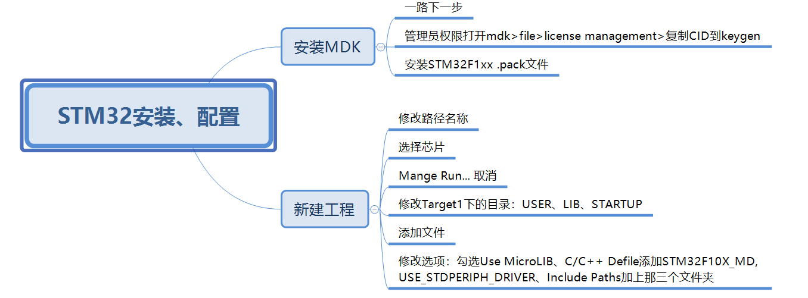

[下载地址](https://guanghou-my.sharepoint.com/:f:/g/personal/chenghello_get365_pw/EhgWI9ibjTFDq1Mab3wvyFsBaLrZJ9T5qW_1DghwHX-Ruw)

另外：修改C/C++，勾选c99

[教程](https://www.cnblogs.com/firege/p/5748260.html)

|   模式   | BOOT0 | BOOT1 |
| :------: | :---: | :---: |
| 普通启动 |   0   |   0   |
| ISP下载  |   1   |   0   |

串口下载引脚：A9和A10