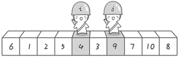
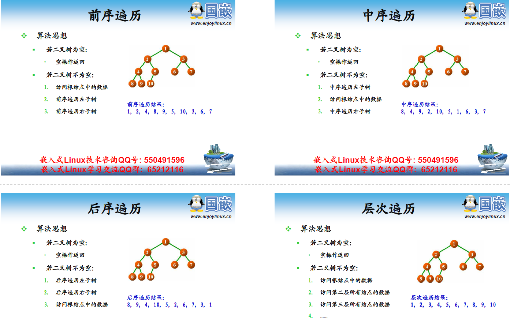

# 顺序线性表

```c
// SeqList.h
#pragma once

typedef void SeqList;
typedef void SeqListNode;

SeqList* SeqList_Create(int capacity);// 创建指定大小的List

void SeqList_Destroy(SeqList* list);// 删除List（不再可用）

void SeqList_Clear(SeqList* list);// 清空List的内容

int SeqList_Length(SeqList* list);// 获取List的长度

int SeqList_Capacity(SeqList* list);// 获取List的容量

int SeqList_Insert(SeqList* list, SeqListNode* node, int pos);// 在指定位置插入一个数据

SeqListNode* SeqList_Get(SeqList* list, int pos);// 获取指定位置数据的指针

SeqListNode* SeqList_Delete(SeqList* list, int pos); // 删除指定位置的数据
```

```c
// SeqList.c
#include "SeqList.h"

#include <stdio.h>
#include <malloc.h>

typedef unsigned int TSeqListNode;//node是int类型，其实里面存的是指针，所以只能以x86运行

typedef struct _tag_SeqList
{
	int capacity;
	int length;
	TSeqListNode* node;
} TSeqList;

//创建指定大小的List
SeqList* SeqList_Create(int capacity) // O(1)
{
	TSeqList* ret = NULL;

	if (capacity >= 0)
	{
		ret = (TSeqList*)malloc(sizeof(TSeqList) + sizeof(TSeqListNode) * capacity);
	}

	if (ret != NULL)
	{
		ret->capacity = capacity;
		ret->length = 0;
		ret->node = (TSeqListNode*)(ret + 1);
		//指针指向TSeqList结构体的末尾，也就是第一个TSeqListNode的位置（因为他们的内存是连续的）
	}

	return ret;
}

// 删除List（不再可用）
void SeqList_Destroy(SeqList* list) // O(1)
{
	free(list);
}

// 清空List的内容
void SeqList_Clear(SeqList* list) // O(1)
{
	TSeqList* sList = (TSeqList*)list;

	if (sList != NULL)
	{
		sList->length = 0;
	}
}

// 获取List的长度
int SeqList_Length(SeqList* list) // O(1)
{
	TSeqList* sList = (TSeqList*)list;
	int ret = -1;

	if (sList != NULL)
	{
		ret = sList->length;
	}

	return ret;
}

// 获取List的容量
int SeqList_Capacity(SeqList* list) // O(1)
{
	TSeqList* sList = (TSeqList*)list;
	int ret = -1;

	if (sList != NULL)
	{
		ret = sList->capacity;
	}

	return ret;
}

// 在指定位置插入一个数据
int SeqList_Insert(SeqList* list, SeqListNode* node, int pos) // O(n) 
{
	TSeqList* sList = (TSeqList*)list;
	int ret = (sList != NULL);//List指针是有效的
	int i = 0;

	/// 判断插入的有效性
	ret = ret && (sList->length + 1 <= sList->capacity);
	ret = ret && (0 <= pos);

	if (ret)/// 执行插入操作
	{
		///如果插入位置大于长度，直接插到末尾
		if (pos >= sList->length)
		{
			pos = sList->length;
		}

		///插入位置后面的元素都向后平移一位
		for (i = sList->length; i > pos; i--)
		{
			sList->node[i] = sList->node[i - 1];
		}

		///插入数据
		sList->node[i] = (TSeqListNode)node;

		sList->length++;///数据长度标记+1
	}

	return ret;
}

// 获取指定位置数据的指针
SeqListNode* SeqList_Get(SeqList* list, int pos) // O(1) 
{
	TSeqList* sList = (TSeqList*)list;
	SeqListNode* ret = NULL;

	if ((sList != NULL) && (0 <= pos) && (pos < sList->length))///非空。位置合法
	{
		ret = (SeqListNode*)(sList->node[pos]);///返回指定位置的指针
	}

	return ret;
}

// 删除指定位置的数据
SeqListNode* SeqList_Delete(SeqList* list, int pos) // O(n)
{
	TSeqList* sList = (TSeqList*)list;
	SeqListNode* ret = SeqList_Get(list, pos);///待删除位置的指针
	int i = 0;

	if (ret != NULL)
	{
		///删除位置后面的元素都向前平移一位
		for (i = pos + 1; i < sList->length; i++)
		{
			sList->node[i - 1] = sList->node[i];
		}

		sList->length--;
	}

	return ret;
}

```


```c
//main.c
#include <stdio.h>
#include <stdlib.h>
#include "SeqList.h"

//需要以x86模式编译，x64出错
// 因为node里存的是四字节指针
int main(int argc, char *argv[])
{
	// 创建线性表，开辟内存空间
	SeqList* list = SeqList_Create(5);

	int i = 0;
	int j = 1;
	int k = 2;
	int x = 3;
	int y = 4;
	int z = 5;
	int index = 0;

	// 在第0位插入0、1、2、3、4、5（最后一位没插上，超过容量了）
	SeqList_Insert(list, &i, 0);// 插入操作输入的元素是int的指针
	SeqList_Insert(list, &j, 0);// 在第0位插入一个数，后面的元素后移
	SeqList_Insert(list, &k, 0);
	SeqList_Insert(list, &x, 0);
	SeqList_Insert(list, &y, 0);
	SeqList_Insert(list, &z, 0);

	for (index = 0; index < SeqList_Length(list); index++)
	{
		// 从0位开始输出线性表的元素
		int* p = (int*)SeqList_Get(list, index);

		printf("%d\n", *p);
	}

	printf("\n");

	while (SeqList_Length(list) > 0)
	{
		// 删除线性表第0位元素（后面的元素前移）
		int* p = (int*)SeqList_Delete(list, 0);

		// 输出剩下的第一位元素
		printf("%d\n", *p);
	}

	SeqList_Destroy(list);

	return 0;
}

//输出：
//4
//3
//2
//1
//0

//4
//3
//2
//1
//0
```

# 链式线性表

```c
// LinkList.h
// 链式线性表
#ifndef _LINKLIST_H_
#define _LINKLIST_H_

// 声明类型
typedef void LinkList;							// 表类型（void）

//*****************************
typedef struct _tag_LinkListNode LinkListNode;	// 节点类型（是一个struct，里面存了一个指向节点的指针）
struct _tag_LinkListNode						//struct的实体
{
    LinkListNode* next;
};
/// 这样不直接声明LinkListNode类型的原因是：它要指向他自己相同的类型。陷入死循环
/// 所以把它本身定义为struct，然后struct中存入一个指针，指针再指向struct
/// 即：struct -存储-> 指针， 指针 -指向-> strcut， struct -存储-> 指针， 指针 -指向-> strcut
//****************************

// 声明函数
LinkList* LinkList_Create();			// 创建

void LinkList_Destroy(LinkList* list);	// 销毁

void LinkList_Clear(LinkList* list);	// 清空

int LinkList_Length(LinkList* list);	// 获取长度

int LinkList_Insert(LinkList* list, LinkListNode* node, int pos);	// 插入元素

LinkListNode* LinkList_Get(LinkList* list, int pos);				// 元素

LinkListNode* LinkList_Delete(LinkList* list, int pos);				// 删除元素

#endif

```

```c
//LinkList.c
#include <stdio.h>
#include <malloc.h>
#include "LinkList.h"

//  真实的表节点类型
/// 头文件里定义的LinkList是void类型，使用时会强制转换
typedef struct _tag_LinkList
{
    LinkListNode header;/// header是个struct，struct里有指向节点的指针
    int length;			/// 表的长度
} TLinkList;

// 创建表
LinkList* LinkList_Create() // O(1)
{
    TLinkList* ret = (TLinkList*)malloc(sizeof(TLinkList));///申请内存（一个 LinkListNode + 一个int）
    
    if( ret != NULL )
    {
        ret->length = 0;		///	设置长度
        ret->header.next = NULL;/// 设置指向第一个元素的指针为NULL
    }
    
    return ret;
}

// 销毁表
void LinkList_Destroy(LinkList* list) // O(1)
{
    free(list); ///释放表头的内存（不管后面元素）
}

//  清空内容
/// 设置表头（不管后面元素）
void LinkList_Clear(LinkList* list) // O(1)
{
    TLinkList* sList = (TLinkList*)list;
    
    if( sList != NULL )
    {
        sList->length = 0;
        sList->header.next = NULL;
    }
}

// 获取表的长度
int LinkList_Length(LinkList* list) // O(1)
{
    TLinkList* sList = (TLinkList*)list;
    int ret = -1;
    
    if( sList != NULL )
    {
        ret = sList->length;
    }
    
    return ret;
}

// 插入元素				表的指针    待插入的节点的指针    插入位置（从0开始）
int LinkList_Insert(LinkList* list, LinkListNode* node, int pos) // O(n)
{ 
    TLinkList* sList = (TLinkList*)list;
    int ret = (sList != NULL) && (pos >= 0) && (node != NULL);///ret==1 允许插入
    int i = 0;
    
    if( ret )
    {
        LinkListNode* current = (LinkListNode*)sList;///把表头作为起始节点
        
        for(i=0; (i<pos) && (current->next != NULL); i++)
        {
            current = current->next;///顺着表头向后查找待插入的位置
			///第pos-1节点指向的下一个节点地址
        }
        
		// 修改node元素前后的指针，使链表接上
        node->next = current->next;	///修改待插入元素next指针（指向node下一个元素）
        current->next = node;		///修改待插入元素前一个元素的next指针（指向node元素）
        
        sList->length++;
    }
    
    return ret;
}

// 获取元素
LinkListNode* LinkList_Get(LinkList* list, int pos) // O(n)
{
    TLinkList* sList = (TLinkList*)list;
    LinkListNode* ret = NULL;
    int i = 0;
    
    if( (sList != NULL) && (0 <= pos) && (pos < sList->length) )///读取的位置合法
    {
        LinkListNode* current = (LinkListNode*)sList;///从表头开始遍历
        
        for(i=0; i<pos; i++)
        {
            current = current->next;///遍历到所需node前面一个node的指针
        }
        
        ret = current->next;//所需node的指针
    }
    
    return ret;
}

// 删除元素
LinkListNode* LinkList_Delete(LinkList* list, int pos) // O(n)
{
    TLinkList* sList = (TLinkList*)list;
    LinkListNode* ret = NULL;
    int i = 0;
    
    if( (sList != NULL) && (0 <= pos) && (pos < sList->length) )///要删除的位置合法
    {
        LinkListNode* current = (LinkListNode*)sList;///从表头开始遍历
        
        for(i=0; i<pos; i++)
        {
            current = current->next;
        }
        
        ret = current->next;		/// 指向要删除元素位置的指针
        current->next = ret->next;	/// 修改 待删除元素的前一个元素的next指针 = 待删除元素的next指针（即跳过了待删除元素）
        
        sList->length--;
    }
    
    return ret;
}

```

```c
// main.c
#include <stdio.h>
#include <stdlib.h>
#include "LinkList.h"

//  值类型
/// 用一个结构体表示，里面有指向下一个节点的地址和实际的值
// 不好用，node存在外部，且不能随便修改删除
struct Value
{
    LinkListNode header;
    int v;
};

int main(int argc, char *argv[]) 
{
    int i = 0;

	//创建表
    LinkList* list = LinkList_Create();
    
	// 创建多个值对象
    struct Value v1;
    struct Value v2;
    struct Value v3;
    struct Value v4;
    struct Value v5;
    
	// 给值对象赋值
    v1.v = 1;
    v2.v = 2;
    v3.v = 3;
    v4.v = 4;
    v5.v = 5;
    
	// 把值对象加入到链式线性表
    LinkList_Insert(list, (LinkListNode*)&v1, LinkList_Length(list));
    LinkList_Insert(list, (LinkListNode*)&v2, LinkList_Length(list));
    LinkList_Insert(list, (LinkListNode*)&v3, LinkList_Length(list));
    LinkList_Insert(list, (LinkListNode*)&v4, LinkList_Length(list));
    LinkList_Insert(list, (LinkListNode*)&v5, LinkList_Length(list));
    
    for(i=0; i<LinkList_Length(list); i++)
    {
		// 获取表中第i个元素的指针
		/// LinkListNode*类型转换成Value*类型
		/// 但是两个struct类型并不一样，Value比LinkListNode多了int类型的元素
		/// 说明了struct类型可以由少元素的类型向多元素的类型强转（类型要是包含关系）

		///struct _tag_LinkListNode
		///{
		///	LinkListNode* next;
		///};

		///struct Value
		///{
		///	LinkListNode header;
		///	int v;
		///};

        struct Value* pv = (struct Value*)LinkList_Get(list, i);
        
        printf("%d\n", pv->v);
    }
    
    while( LinkList_Length(list) > 0 )
    {
        // 逐个删除第0位的元素（Value对象还在）
        struct Value* pv = (struct Value*)LinkList_Delete(list, 0);
        
        printf("%d\n", pv->v);
    }
    
    LinkList_Destroy(list);
    
    return 0;
}

```

# 静态链表

```c
// StaticList.h
// 静态链表
// 静态链表是在顺序表的基础上,利用数组实现的单链表
// 即：用数组这样连续的内存来存储node，不像顺序链表那样node存储再链表外面

#ifndef _STATICLIST_H_
#define _STATICLIST_H_

typedef void StaticList;		// List类型（void）
typedef void StaticListNode;	// Node类型（void）

StaticList* StaticList_Create(int capacity);	// 创建表

void StaticList_Destroy(StaticList* list);		// 销毁表

void StaticList_Clear(StaticList* list);		// 清空表

int StaticList_Length(StaticList* list);		// 获取表的长度

int StaticList_Capacity(StaticList* list);		// 获取表的容量

int StaticList_Insert(StaticList* list, StaticListNode* node, int pos);	// 插入数据

StaticListNode* StaticList_Get(StaticList* list, int pos);				// 获取数据

StaticListNode* StaticList_Delete(StaticList* list, int pos);			// 删除数据

#endif

```

```c
// StaticList.c
#include <stdio.h>
#include <malloc.h>
#include "StaticList.h"

#define AVAILABLE -1

// 实际的节点类型
typedef struct _tag_StaticListNode
{
    unsigned int data;//本程序中是当指针来用的，指向int变量
    int next;
} TStaticListNode;

// 实际的静态链表类型
typedef struct _tag_StaticList
{
    int capacity;
    TStaticListNode header;/// 1个node
    TStaticListNode node[];/// capacity个node
						   /// node[0]和header都是表头，两个数据一样。所以实际存数据的node[1]-node[capacity]
						   /// 实际header和node[0]重复了，没必要
} TStaticList;

// 创建表
StaticList* StaticList_Create(int capacity) // O(n)
{
    TStaticList* ret = NULL;
    int i = 0;
    
    if( capacity >= 0 )
    {
        ret = (TStaticList*)malloc(sizeof(TStaticList) + sizeof(TStaticListNode) * (capacity + 1));
		/// 申请内容容量 = size(表头) + size(节点)*(容量+1)
		/// 
    }
    
    if( ret != NULL )
    {
        ret->capacity = capacity;
        ret->header.data = 0;/// 表头node的data存储表的大小
        ret->header.next = 0;/// next指向第一个数据node
        
        for(i=1; i<=capacity; i++)
        {
            ret->node[i].next = AVAILABLE;/// 除表头之外的节点都标记为可用
        }
    }
    
    return ret;
}

// 销毁表
void StaticList_Destroy(StaticList* list) // O(1)
{
    free(list);
}

// 清空表
void StaticList_Clear(StaticList* list) // O(n)
{
    TStaticList* sList = (TStaticList*)list;
    int i = 0;
    
    if( sList != NULL )
    {
        sList->header.data = 0;/// 清空表头
        sList->header.next = 0;
        
        for(i=1; i<=sList->capacity; i++)///清空后面节点的内容
        {
            sList->node[i].next = AVAILABLE;
        }
    }
}

// 获取表的长度
int StaticList_Length(StaticList* list) // O(1)
{
    TStaticList* sList = (TStaticList*)list;
    int ret = -1;
    
    if( sList != NULL )
    {
        ret = sList->header.data;///表长度存储再表头node中
    }
    
    return ret;
}

// 获取表的容量
int StaticList_Capacity(StaticList* list) // O(1)
{
    TStaticList* sList = (TStaticList*)list;
    int ret = -1;
    
    if( sList != NULL )
    {
        ret = sList->capacity;
    }
    
    return ret;
}

// 插入数据								node是个int之类的数据
int StaticList_Insert(StaticList* list, StaticListNode* node, int pos)  // O(n)
{
    TStaticList* sList = (TStaticList*)list;
    int ret = (sList != NULL); ///判断表有效
    int current = 0;	/// 指向node[pos-1]的位置
    int index = 0;		/// 指向node[pos]的位置
    int i = 0;
    
    ret = ret && (sList->header.data + 1 <= sList->capacity);	///判断表没超容量
    ret = ret && (pos >=0) && (node != NULL);					///判断插入位置合法
    
    if( ret )
    {
        for(i=1; i<=sList->capacity; i++)///从node[1]开始向后遍历
        {
            if( sList->node[i].next == AVAILABLE )///找到空闲node的位置
            {
                index = i;
                break;
            }
        }
        
        sList->node[index].data = (unsigned int)node;///给空闲node赋值

		//**************下面开始调整指针***********************

        sList->node[0] = sList->header;///加载表头（表头next指向node[1]）
        
        for(i=0; (i<pos) && (sList->node[current].next != 0); i++)///这里从0开始遍历（node[0]是第一个node的前一个node，不存储元素，但存储指向第一个node的指针）
        {
			/// 找到pos的前一个node位置（i == pos）
			///  或者是最后一个node位置(next == 0)
			/// 即插入位置的前一个node位置
            current = sList->node[current].next;
        }
        
        sList->node[index].next = sList->node[current].next;///把node[pos+1]的指针存入node[pos]中
        sList->node[current].next = index;					///把node[pos]的指针存入node[pos-1]中
        
        sList->node[0].data++;
        
        sList->header = sList->node[0];///用node[0]替换header
    }
    
    return ret;
}

// 获取数据
StaticListNode* StaticList_Get(StaticList* list, int pos)  // O(n)
{
    TStaticList* sList = (TStaticList*)list;
    StaticListNode* ret = NULL;
    int current = 0;
    int object = 0;
    int i = 0;
    
    if( (sList != NULL) && (0 <= pos) && (pos < sList->header.data) )/// 要获取的位置合法
    {
        sList->node[0] = sList->header;///加载表头（表头next指向node[1]）
        
        for(i=0; i<pos; i++)
        {
            current = sList->node[current].next;
        }
        
        object = sList->node[current].next;/// 遍历到要获取的node
        
        ret = (StaticListNode*)(sList->node[object].data);
    }
    
    return ret;
}

// 删除数据
StaticListNode* StaticList_Delete(StaticList* list, int pos) // O(n)
{
    TStaticList* sList = (TStaticList*)list;
    StaticListNode* ret = NULL;
    int current = 0;
    int object = 0;
    int i = 0;
    
    if( (sList != NULL) && (0 <= pos) && (pos < sList->header.data) )/// 要获取的位置合法
    {
        sList->node[0] = sList->header;///加载表头（表头next指向node[1]）
        
        for(i=0; i<pos; i++)
        {
            current = sList->node[current].next;/// 要删除node的前一个node
        }
        
        object = sList->node[current].next;/// 要删除的node
        
        sList->node[current].next = sList->node[object].next;/// 要删除node的前一个node -指向-> 要删除node下一个node（跳过了要删除的node）
        
        sList->node[0].data--;
        
        sList->header = sList->node[0];
        
        sList->node[object].next = AVAILABLE;///标记删除的node位置为可用
        
        ret = (StaticListNode*)(sList->node[object].data);
    }
    
    return ret;
}
```

```c
// main.c
#include <stdio.h>
#include <stdlib.h>
#include "StaticList.h"

int main(int argc, char *argv[])
{
    StaticList* list = StaticList_Create(10);
    
    int index = 0;
    
    int i = 0;
    int j = 1;
    int k = 2;
    int x = 3;
    int y = 4;
    int z = 5;
    /// 本程序中TStaticListNode.data存的是指针，所以传入的是插入 &i
    StaticList_Insert(list, &i, 0);
    StaticList_Insert(list, &j, 0);
    StaticList_Insert(list, &k, 0);
    
    for(index=0; index<StaticList_Length(list); index++)
    {
		///获取的还是地址
        int* p = (int*)StaticList_Get(list, index);
        
        printf("%d\n", *p);
    }
    
    printf("\n");
    
    while( StaticList_Length(list) > 0 )
    {
        int* p = (int*)StaticList_Delete(list, 0);
        
        printf("%d\n", *p);
    }
    
    printf("\n");
    
    StaticList_Insert(list, &x, 0);
    StaticList_Insert(list, &y, 0);
    StaticList_Insert(list, &z, 0);
    
	///隐式的uint转int
    printf("Capacity: %d Length: %d\n", StaticList_Capacity(list), StaticList_Length(list));
    
    for(index=0; index<StaticList_Length(list); index++)
    {
        int* p = (int*)StaticList_Get(list, index);
        
        printf("%d\n", *p);
    }
    
    StaticList_Destroy(list);
    
	return 0;
}
```

```
输出：
2
1
0

2
1
0

Capacity: 10 Length: 3
5
4
3
```

# 循环列表

```c
// CircleList.h
// 循环链表

#ifndef _CIRCLELIST_H_
#define _CIRCLELIST_H_

// 表类型
typedef void CircleList;
// 节点类型
typedef struct _tag_CircleListNode CircleListNode;
struct _tag_CircleListNode
{
    CircleListNode* next;
};

CircleList* CircleList_Create();

void CircleList_Destroy(CircleList* list);

void CircleList_Clear(CircleList* list);

int CircleList_Length(CircleList* list);

int CircleList_Insert(CircleList* list, CircleListNode* node, int pos);

CircleListNode* CircleList_Get(CircleList* list, int pos);

CircleListNode* CircleList_Delete(CircleList* list, int pos);// 删除从头开始pos位置的节点（pos 可大于 length，循环遍历）

CircleListNode* CircleList_DeleteNode(CircleList* list, CircleListNode* node);// 删除从头开始pos位置的节点（pos < length）

CircleListNode* CircleList_Reset(CircleList* list);// 重置游标到第一个节点

CircleListNode* CircleList_Current(CircleList* list);// 获取当前游标

CircleListNode* CircleList_Next(CircleList* list);// 游标向后移动一位

#endif

```

```c
// CircleList.c
#include <stdio.h>
#include <malloc.h>
#include "CircleList.h"

typedef struct _tag_CircleList
{
    CircleListNode header;	///链表头
    CircleListNode* slider;	///游标指针
    int length;
} TCircleList;

// 创建表
CircleList* CircleList_Create() // O(1)
{
    TCircleList* ret = (TCircleList*)malloc(sizeof(TCircleList));
    
    if( ret != NULL )
    {
        ret->length = 0;
        ret->header.next = NULL;
        ret->slider = NULL;
    }
    
    return ret;
}

// 删除表
void CircleList_Destroy(CircleList* list) // O(1)
{
    free(list);
}

// 清空表
void CircleList_Clear(CircleList* list) // O(1)
{
    TCircleList* sList = (TCircleList*)list;
    
    if( sList != NULL )
    {
        sList->length = 0;
        sList->header.next = NULL;
        sList->slider = NULL;
    }
}

// 表长度
int CircleList_Length(CircleList* list) // O(1)
{
    TCircleList* sList = (TCircleList*)list;
    int ret = -1;
    
    if( sList != NULL )
    {
        ret = sList->length;
    }
    
    return ret;
}

// 在从头开始的pos位置插入一个node
int CircleList_Insert(CircleList* list, CircleListNode* node, int pos) // O(n)
{ 
    TCircleList* sList = (TCircleList*)list;
    int ret = (sList != NULL) && (pos >= 0) && (node != NULL);
    int i = 0;
    
    if( ret )
    {
        CircleListNode* current = (CircleListNode*)sList;
        
        for(i=0; (i<pos) && (current->next != NULL); i++)
        {
            current = current->next;
        }
		/// current->next指向node[pos]
        
        node->next = current->next;		/// 让node->next指向node[pos]
        current->next = node;			/// 让current->next指向node[node]
										/// 即：node插入到了node[pos],原node[pos]变成了node[pos+1]
        
        if( sList->length == 0 )// 如果循环链表长度为1
        {
            sList->slider = node;	///让游标指向唯一的节点
            node->next = node;		///让这个节点指向自己
        }
        
        sList->length++;
    }
    
    return ret;
}

// 获取从头开始pos位置的节点
CircleListNode* CircleList_Get(CircleList* list, int pos) // O(n)
{
    TCircleList* sList = (TCircleList*)list;
    CircleListNode* ret = NULL;
    int i = 0;
    
    if( (sList != NULL) && (pos >= 0) )
    {
        CircleListNode* current = (CircleListNode*)sList;
        
        for(i=0; i<pos; i++)
        {
            current = current->next;
        }
        
        ret = current->next;///找到的节点
    }
    
    return ret;
}

// 删除从头开始pos位置的节点（pos 可大于 length，循环遍历）
CircleListNode* CircleList_Delete(CircleList* list, int pos) // O(n)
{
    TCircleList* sList = (TCircleList*)list;
    CircleListNode* ret = NULL;
    int i = 0;
    
    if( (sList != NULL) && (pos >= 0) )
    {
        CircleListNode* current = (CircleListNode*)sList;									/// pos节点
        CircleListNode* first = sList->header.next;											/// 首节点
        CircleListNode* last = (CircleListNode*)CircleList_Get(sList, sList->length - 1);	/// 尾节点
        
        for(i=0; i<pos; i++)
        {
            current = current->next;
        }
		/// current是pos前一个节点

        ret = current->next;			/// pos节点
        current->next = ret->next;		/// 让current指向pos后一个节点，跳过pos节点
        
        sList->length--;
        
        if( first == ret )			// 如果删除的是首节点
        {
            sList->header.next = ret->next; /// 修改header表头
            last->next = ret->next;			/// 链表末尾指向链表首端（好像没必要）
        }
        
        if( sList->slider == ret )	// 如果删除的节点位置的是游标
        {
            sList->slider = ret->next;///让游标指向下一个
        }
        
        if( sList->length == 0 )	//如果删没了
        {
            sList->header.next = NULL;
            sList->slider = NULL;
        }
    }
    
    return ret;
}

// 删除从头开始pos位置的节点（pos < length）
CircleListNode* CircleList_DeleteNode(CircleList* list, CircleListNode* node) // O(n)
{
    TCircleList* sList = (TCircleList*)list;
    CircleListNode* ret = NULL;
    int i = 0;
    
    if( sList != NULL )
    {
        CircleListNode* current = (CircleListNode*)sList;
        
        for(i=0; i<sList->length; i++)
        {
            if( current->next == node )
            {
                ret = current->next;///遍历到pos位置
                break;
            }
            
            current = current->next;
        }
        
        if( ret != NULL )
        {
            CircleList_Delete(sList, i);
        }
    }
    
    return ret;
}

// 重置游标到第一个节点
CircleListNode* CircleList_Reset(CircleList* list) // O(1)
{
    TCircleList* sList = (TCircleList*)list;
    CircleListNode* ret = NULL;
    
    if( sList != NULL )
    {
        sList->slider = sList->header.next;
        ret = sList->slider;
    }
    
    return ret;
}

// 获取当前游标
CircleListNode* CircleList_Current(CircleList* list) // O(1)
{
    TCircleList* sList = (TCircleList*)list;
    CircleListNode* ret = NULL;
    
    if( sList != NULL )
    {
        ret = sList->slider;
    }
    
    return ret;
}

// 游标向后移动一位
CircleListNode* CircleList_Next(CircleList* list) // O(1)
{
    TCircleList* sList = (TCircleList*)list;
    CircleListNode* ret = NULL;
    
    if( (sList != NULL) && (sList->slider != NULL) )
    {
        ret = sList->slider;
        sList->slider = ret->next;
    }
    
    return ret;
}

```

```c
// main.c
#include <stdio.h>
#include <stdlib.h>
#include "CircleList.h"

struct Value
{
    CircleListNode header;	/// 指向下一个节点的指针
    int v;					/// 存的值
};

int main(int argc, char *argv[])
{
    int i = 0;
    CircleList* list = CircleList_Create();
    
    struct Value v1;
    struct Value v2;
    struct Value v3;
    struct Value v4;
    struct Value v5;
    struct Value v6;
    struct Value v7;
    struct Value v8;
    
    v1.v = 1;
    v2.v = 2;
    v3.v = 3;
    v4.v = 4;
    v5.v = 5;
    v6.v = 6;
    v7.v = 7;
    v8.v = 8;
    
	// （在尾端）插入节点
    CircleList_Insert(list, (CircleListNode*)&v1, CircleList_Length(list));
    CircleList_Insert(list, (CircleListNode*)&v2, CircleList_Length(list));
    CircleList_Insert(list, (CircleListNode*)&v3, CircleList_Length(list));
    CircleList_Insert(list, (CircleListNode*)&v4, CircleList_Length(list));
    
    CircleList_Insert(list, (CircleListNode*)&v5, 5);
	// 删除第0个节点
    CircleList_Delete(list, 0);
    
    for(i=0; i<2*CircleList_Length(list); i++)
    {
		// 把列表循环遍历2遍
        struct Value* pv = (struct Value*)CircleList_Get(list, i);
        
        printf("%d\n", pv->v);
    }
    
    printf("\n");
    
    while( CircleList_Length(list) > 0 )
    {
		// 删除节点
        struct Value* pv = (struct Value*)CircleList_Delete(list, 0);
        
        printf("%d\n", pv->v);
    }
    
    printf("\n");
    
	// 重新把数据插进去
    CircleList_Insert(list, (CircleListNode*)&v1, CircleList_Length(list));
    CircleList_Insert(list, (CircleListNode*)&v2, CircleList_Length(list));
    CircleList_Insert(list, (CircleListNode*)&v3, CircleList_Length(list));
    CircleList_Insert(list, (CircleListNode*)&v4, CircleList_Length(list));
    CircleList_Insert(list, (CircleListNode*)&v5, CircleList_Length(list));
    CircleList_Insert(list, (CircleListNode*)&v6, CircleList_Length(list));
    CircleList_Insert(list, (CircleListNode*)&v7, CircleList_Length(list));
    CircleList_Insert(list, (CircleListNode*)&v8, CircleList_Length(list));
    
    for(i=0; i<CircleList_Length(list); i++)
    {
		// 游标
        struct Value* pv = (struct Value*)CircleList_Next(list);
        
        printf("%d\n", pv->v);
    }
    
    printf("\n");
    
    CircleList_Reset(list);// 重置游标到第一个节点
    
    while( CircleList_Length(list) > 0 )
    {
        struct Value* pv = NULL;
        
        for(i=1; i<3; i++)
        {
			// 移动游标
            CircleList_Next(list);
        }
        
        pv = (struct Value*)CircleList_Current(list);// 当前游标位置
        
        printf("%d\n", pv->v);
        
        CircleList_DeleteNode(list, (CircleListNode*)pv);// 删除节点
    }
    
    CircleList_Destroy(list);
    
	return 0;
}

```

输出

```
5
2
3
4
5
2
3
4

5
2
3
4

1
2
3
4
5
6
7
8

3
6
1
5
2
8
4
7
```

# 双向链表

```c
// DLinkList.h
// 双向链表
// 单链表局限性：每个节点只有一个指向下一个结点指针，单链表的数据元素不能直接访问其前驱元素
// 双链表有双向指针

#ifndef _DLINKLIST_H_
#define _DLINKLIST_H_

typedef void DLinkList;							// 链表是void类型（使用时强制修改成TDLinkList的struct类型）
typedef struct _tag_DLinkListNode DLinkListNode;// node是struct类型
struct _tag_DLinkListNode
{
    DLinkListNode* next;/// 指向下一个结点
    DLinkListNode* pre;	/// 指向前一个结点
};

DLinkList* DLinkList_Create();

void DLinkList_Destroy(DLinkList* list);

void DLinkList_Clear(DLinkList* list);

int DLinkList_Length(DLinkList* list);

int DLinkList_Insert(DLinkList* list, DLinkListNode* node, int pos);

DLinkListNode* DLinkList_Get(DLinkList* list, int pos);

DLinkListNode* DLinkList_Delete(DLinkList* list, int pos);

DLinkListNode* DLinkList_DeleteNode(DLinkList* list, DLinkListNode* node);

DLinkListNode* DLinkList_Reset(DLinkList* list);

DLinkListNode* DLinkList_Current(DLinkList* list);

DLinkListNode* DLinkList_Next(DLinkList* list);

DLinkListNode* DLinkList_Pre(DLinkList* list);

#endif

```

```c
// DLinkList.c
#include <stdio.h>
#include <malloc.h>
#include "DLinkList.h"

// 真实的链表类型
typedef struct _tag_DLinkList
{
    DLinkListNode header;	/// header.next指向第一个node，header.pre指向最后一个node
    DLinkListNode* slider;	/// 游标
    int length;				/// 链表长度
} TDLinkList;

// 创建链表
DLinkList* DLinkList_Create() // O(1)
{
    TDLinkList* ret = (TDLinkList*)malloc(sizeof(TDLinkList));
    
    if( ret != NULL )
    {
        ret->length = 0;
        ret->header.next = NULL;
        ret->header.pre = NULL;
        ret->slider = NULL;
    }
    
    return ret;
}

// 销毁
void DLinkList_Destroy(DLinkList* list) // O(1)
{
    free(list);
}

// 清空
void DLinkList_Clear(DLinkList* list) // O(1)
{
    TDLinkList* sList = (TDLinkList*)list;
    
    if( sList != NULL )
    {
        sList->length = 0;
        sList->header.next = NULL;
        sList->header.pre = NULL;
        sList->slider = NULL;
    }
}

// 获取长度
int DLinkList_Length(DLinkList* list) // O(1)
{
    TDLinkList* sList = (TDLinkList*)list;
    int ret = -1;
    
    if( sList != NULL )
    {
        ret = sList->length;
    }
    
    return ret;
}

// 插入结点
int DLinkList_Insert(DLinkList* list, DLinkListNode* node, int pos) // O(n)
{ 
    TDLinkList* sList = (TDLinkList*)list;
    int ret = (sList != NULL) && (pos >= 0) && (node != NULL);
    int i = 0;
    
    if( ret )
    {
        DLinkListNode* current = (DLinkListNode*)sList;
        DLinkListNode* next = NULL;
        
        for(i=0; (i<pos) && (current->next != NULL); i++)/// 遍历到pos位置或链表末尾
        {
            current = current->next;
        }
        
        next = current->next;
        
		/// 修改next指针
        current->next = node;	/// pos前一个node 指向 pos位置的node
        node->next = next;		/// pos位置的node 指向 pos下一个node
        
		/// 修改pre指针
        if( next != NULL )
        {
            next->pre = node;	/// 插入位置不是末尾，就修改 pos下一个node 的pre指针
        }
        
        node->pre = current;	/// 修改pos位置的pre指针
        
		/// 如果插入的是第一个元素
        if( sList->length == 0 )
        {
            node->pre = NULL;		/// 修改前，node->pre指向的是list
            sList->slider = node;
        }
        
        sList->length++;
    }
    
    return ret;
}

// 获取node元素的指针
DLinkListNode* DLinkList_Get(DLinkList* list, int pos) // O(n)
{
    TDLinkList* sList = (TDLinkList*)list;
    DLinkListNode* ret = NULL;
    int i = 0;
    
    if( (sList != NULL) && (0 <= pos) && (pos < sList->length) )///位置合法
    {
        DLinkListNode* current = (DLinkListNode*)sList;
        
        for(i=0; i<pos; i++)/// 遍历到pos前一个node
        {
            current = current->next;
        }
        
        ret = current->next;
    }
    
    return ret;
}

// 删除node（输入参数是位置pos）
DLinkListNode* DLinkList_Delete(DLinkList* list, int pos) // O(n)
{
    TDLinkList* sList = (TDLinkList*)list;
    DLinkListNode* ret = NULL;
    int i = 0;
    
    if( (sList != NULL) && (0 <= pos) && (pos < sList->length) )///位置合法
    {
        DLinkListNode* current = (DLinkListNode*)sList;
        DLinkListNode* next = NULL;
        
        for(i=0; i<pos; i++)
        {
            current = current->next;/// 遍历到pos前一个node
        }
        
        ret = current->next;
        next = ret->next;
        
        current->next = next;	///修改前一个node指向后一个node（跳过当前node）
        
        if( next != NULL )		///如果删除的不是末尾
        {
            next->pre = current;///修改后一个node的前向指针指向前一个node（跳过当前node）
            
            if( current == (DLinkListNode*)sList )///如果删除的是唯一一个node
            {
                next->pre = NULL;
            }
        }
        
        if( sList->slider == ret )///如果删除的是游标
        {
            sList->slider = next;
        }
        
        sList->length--;
    }
    
    return ret;
}

// 删除node（输入参数是结点mode）
DLinkListNode* DLinkList_DeleteNode(DLinkList* list, DLinkListNode* node)
{
    TDLinkList* sList = (TDLinkList*)list;
    DLinkListNode* ret = NULL;
    int i = 0;
    
    if( sList != NULL )
    {
        DLinkListNode* current = (DLinkListNode*)sList;
        
        for(i=0; i<sList->length; i++)
        {
            if( current->next == node )
            {
                ret = current->next;
                break;
            }
            
            current = current->next;
        }
        
        if( ret != NULL )
        {
            DLinkList_Delete(sList, i);
        }
    }
    
    return ret;
}

// 重置游标
DLinkListNode* DLinkList_Reset(DLinkList* list)
{
    TDLinkList* sList = (TDLinkList*)list;
    DLinkListNode* ret = NULL;
    
    if( sList != NULL )
    {
        sList->slider = sList->header.next;
        ret = sList->slider;
    }
    
    return ret;
}

// 获取当前游标
DLinkListNode* DLinkList_Current(DLinkList* list)
{
    TDLinkList* sList = (TDLinkList*)list;
    DLinkListNode* ret = NULL;
    
    if( sList != NULL )
    {
        ret = sList->slider;
    }
    
    return ret;
}

// 游标后移一位
DLinkListNode* DLinkList_Next(DLinkList* list)
{
    TDLinkList* sList = (TDLinkList*)list;
    DLinkListNode* ret = NULL;
    
    if( (sList != NULL) && (sList->slider != NULL) )
    {
        ret = sList->slider;
        sList->slider = ret->next;
    }
    
    return ret;
}

// 游标前移一位
DLinkListNode* DLinkList_Pre(DLinkList* list)
{
    TDLinkList* sList = (TDLinkList*)list;
    DLinkListNode* ret = NULL;
    
    if( (sList != NULL) && (sList->slider != NULL) )
    {
        ret = sList->slider;
        sList->slider = ret->pre;
    }
    
    return ret;
}

```

```c
// main.c
#include <stdio.h>
#include <stdlib.h>
#include "DLinkList.h"

struct Value
{
	//每个值对象都由前后指针和存储的值组成
    DLinkListNode header;
    int v;
};

int main(int argc, char *argv[])
{
    int i = 0;
    DLinkList* list = DLinkList_Create();
    struct Value* pv = NULL;
    struct Value v1;
    struct Value v2;
    struct Value v3;
    struct Value v4;
    struct Value v5;
    
    v1.v = 1;
    v2.v = 2;
    v3.v = 3;
    v4.v = 4;
    v5.v = 5;
    
	// 插入数据：链表指针、值对象指针、插入位置
    DLinkList_Insert(list, (DLinkListNode*)&v1, DLinkList_Length(list));
    DLinkList_Insert(list, (DLinkListNode*)&v2, DLinkList_Length(list));
    DLinkList_Insert(list, (DLinkListNode*)&v3, DLinkList_Length(list));
    DLinkList_Insert(list, (DLinkListNode*)&v4, DLinkList_Length(list));
    DLinkList_Insert(list, (DLinkListNode*)&v5, DLinkList_Length(list));
    
    for(i=0; i<DLinkList_Length(list); i++)
    {
		// 读取数据
        pv = (struct Value*)DLinkList_Get(list, i);
        
        printf("%d\n", pv->v);
    }
    
    printf("\n");
    
	// 删除数据（按位置）
    DLinkList_Delete(list, DLinkList_Length(list)-1);	/// 删除末尾数据
    DLinkList_Delete(list, 0);							///删除首数据
    
    for(i=0; i<DLinkList_Length(list); i++)
    {
        pv = (struct Value*)DLinkList_Next(list);		///游标前移
        
        printf("%d\n", pv->v);
    }
    
    printf("\n");
    
    DLinkList_Reset(list);	//重置游标
    DLinkList_Next(list);
    
    pv = (struct Value*)DLinkList_Current(list);// 当前游标
    
    printf("%d\n", pv->v);
    
    DLinkList_DeleteNode(list, (DLinkListNode*)pv);// 删除数据（按node指针）
    
    pv = (struct Value*)DLinkList_Current(list);
    
    printf("%d\n", pv->v);
    
    DLinkList_Pre(list);// 游标前移
    
    pv = (struct Value*)DLinkList_Current(list);
    
    printf("%d\n", pv->v);
    
    printf("Length: %d\n", DLinkList_Length(list));
    
    DLinkList_Destroy(list);
    
	return 0;
}

```

输出

```
1
2
3
4
5

2
3
4

3
4
2
Length: 2
```

# 栈(基于顺序表)

栈是一种特殊的线性表
只能从栈顶操作，先进后出
本程序中SeqList.h/c就是之前的顺序线性表

```c
// SeqList.h
#ifndef _SEQLIST_H_
#define _SEQLIST_H_

typedef void SeqList;
typedef void SeqListNode;

SeqList* SeqList_Create(int capacity);

void SeqList_Destroy(SeqList* list);

void SeqList_Clear(SeqList* list);

int SeqList_Length(SeqList* list);

int SeqList_Capacity(SeqList* list);

int SeqList_Insert(SeqList* list, SeqListNode* node, int pos);

SeqListNode* SeqList_Get(SeqList* list, int pos);

SeqListNode* SeqList_Delete(SeqList* list, int pos);

#endif
```

```c
// SeqList.c
#include <stdio.h>
#include <malloc.h>
#include "SeqList.h"

typedef unsigned int TSeqListNode;

typedef struct _tag_SeqList
{
    int capacity;
    int length;
    TSeqListNode* node;
} TSeqList;

SeqList* SeqList_Create(int capacity) // O(1)
{
    TSeqList* ret = NULL;
    
    if( capacity >= 0 )
    {
        ret = (TSeqList*)malloc(sizeof(TSeqList) + sizeof(TSeqListNode) * capacity);
    }
    
    if( ret != NULL )
    {
        ret->capacity = capacity;
        ret->length = 0;
        ret->node = (TSeqListNode*)(ret + 1);
    }
    
    return ret;
}

void SeqList_Destroy(SeqList* list) // O(1)
{
    free(list);
}

void SeqList_Clear(SeqList* list) // O(1)
{
    TSeqList* sList = (TSeqList*)list;
    
    if( sList != NULL )
    {
        sList->length = 0;
    }
}

int SeqList_Length(SeqList* list) // O(1)
{
    TSeqList* sList = (TSeqList*)list;
    int ret = -1;
    
    if( sList != NULL )
    {
        ret = sList->length;
    }
    
    return ret;
}

int SeqList_Capacity(SeqList* list) // O(1)
{
    TSeqList* sList = (TSeqList*)list;
    int ret = -1;
    
    if( sList != NULL )
    {
        ret = sList->capacity;
    }
    
    return ret;
}

int SeqList_Insert(SeqList* list, SeqListNode* node, int pos) // O(n) 
{
    TSeqList* sList = (TSeqList*)list;
    int ret = (sList != NULL);
    int i = 0;
    
    ret = ret && (sList->length + 1 <= sList->capacity);
    ret = ret && (0 <= pos);
    
    if( ret )
    {
        if( pos >= sList->length )
        {
            pos = sList->length;
        }
        
        for(i=sList->length; i>pos; i--)
        {
            sList->node[i] = sList->node[i-1];// 插入时后面的node后移
        }
        
        sList->node[i] = (TSeqListNode)node;
        
        sList->length++;
    }
    
    return ret;
}

SeqListNode* SeqList_Get(SeqList* list, int pos) // O(1) 
{
    TSeqList* sList = (TSeqList*)list;
    SeqListNode* ret = NULL;
    
    if( (sList != NULL) && (0 <= pos) && (pos < sList->length) )
    {
        ret = (SeqListNode*)(sList->node[pos]);
    }
    
    return ret;
}

SeqListNode* SeqList_Delete(SeqList* list, int pos) // O(n)
{
    TSeqList* sList = (TSeqList*)list;
    SeqListNode* ret = SeqList_Get(list, pos);
    int i = 0;
    
    if( ret != NULL )
    {
        for(i=pos+1; i<sList->length; i++)
        {
            sList->node[i-1] = sList->node[i];// 删除时后面的node前移
        }
        
        sList->length--;
    }
    
    return ret;
}

```

```c
// SeqStack.h
// 栈：只对栈顶操作
#ifndef _SEQSTACK_H_
#define _SEQSTACK_H_

typedef void SeqStack;

SeqStack* SeqStack_Create(int capacity);			// 创建

void SeqStack_Destroy(SeqStack* stack);				// 销毁

void SeqStack_Clear(SeqStack* stack);				// 清空

int SeqStack_Push(SeqStack* stack, void* item);		// 入栈

void* SeqStack_Pop(SeqStack* stack);				// 出栈

void* SeqStack_Top(SeqStack* stack);				// 读取栈顶，但不删除

int SeqStack_Size(SeqStack* stack);					// 大小

int SeqStack_Capacity(SeqStack* stack);				// 容量

#endif

```

```c
// SeqStack.c
#include "SeqStack.h"
#include "SeqList.h"

SeqStack* SeqStack_Create(int capacity)
{
    return SeqList_Create(capacity);
}

void SeqStack_Destroy(SeqStack* stack)
{
    SeqList_Destroy(stack);
}

void SeqStack_Clear(SeqStack* stack)
{
    SeqList_Clear(stack);
}

// 入栈
int SeqStack_Push(SeqStack* stack, void* item)
{
    return SeqList_Insert(stack, item, SeqList_Length(stack));	/// 入栈：在末尾之后插入
}

// 出栈
void* SeqStack_Pop(SeqStack* stack)
{
    return SeqList_Delete(stack, SeqList_Length(stack) - 1);	/// 出栈：把末尾node删除
}

void* SeqStack_Top(SeqStack* stack)
{
    return SeqList_Get(stack, SeqList_Length(stack) - 1);		/// 读栈顶，但不删除
}

int SeqStack_Size(SeqStack* stack)
{
    return SeqList_Length(stack);
}

int SeqStack_Capacity(SeqStack* stack)
{
    return SeqList_Capacity(stack);
}

```

```c
// main.c
#include <stdio.h>
#include <stdlib.h>
#include "SeqStack.h"

// 栈是一种特殊的线性表
// 只能从栈顶操作，先进后出
// 本程序中SeqList.h/c就是之前的顺序线性表

int main(int argc, char *argv[]) 
{
    SeqStack* stack = SeqStack_Create(20);
    int a[10];
    int i = 0;
    
    for(i=0; i<10; i++)
    {
        a[i] = i;
        
        SeqStack_Push(stack, a + i);// 入栈
    }
    
    printf("Top: %d\n", *(int*)SeqStack_Top(stack));	// 栈顶
    printf("Capacity: %d\n", SeqStack_Capacity(stack));	// 大小
    printf("Length: %d\n", SeqStack_Size(stack));		// 容量
    
    while( SeqStack_Size(stack) > 0 )
    {
        printf("Pop: %d\n", *(int*)SeqStack_Pop(stack));// 出栈
    }
    
    SeqStack_Destroy(stack);	// 销毁
    
	return 0;
}

```

输出

```
Top: 9
Capacity: 20
Length: 10
Pop: 9
Pop: 8
Pop: 7
Pop: 6
Pop: 5
Pop: 4
Pop: 3
Pop: 2
Pop: 1
Pop: 0
```

# 栈(基于链式表)

```c
// LinkList.h
// 链式线性表
#ifndef _LINKLIST_H_
#define _LINKLIST_H_

typedef void LinkList;
typedef struct _tag_LinkListNode LinkListNode;
struct _tag_LinkListNode
{
    LinkListNode* next;
};

LinkList* LinkList_Create();

void LinkList_Destroy(LinkList* list);

void LinkList_Clear(LinkList* list);

int LinkList_Length(LinkList* list);

int LinkList_Insert(LinkList* list, LinkListNode* node, int pos);

LinkListNode* LinkList_Get(LinkList* list, int pos);

LinkListNode* LinkList_Delete(LinkList* list, int pos);

#endif
```

```c
// LinkList.c
#include <stdio.h>
#include <malloc.h>
#include "LinkList.h"

typedef struct _tag_LinkList
{
    LinkListNode header;
    int length;
} TLinkList;

LinkList* LinkList_Create() // O(1)
{
    TLinkList* ret = (TLinkList*)malloc(sizeof(TLinkList));
	// 非静态的链表，只申请了List头的内存，node都存储在List外部
    
    if( ret != NULL )
    {
        ret->length = 0;
        ret->header.next = NULL;
    }
    
    return ret;
}

void LinkList_Destroy(LinkList* list) // O(1)
{
    free(list);
}

void LinkList_Clear(LinkList* list) // O(1)
{
    TLinkList* sList = (TLinkList*)list;
    
    if( sList != NULL )
    {
        sList->length = 0;
        sList->header.next = NULL;
    }
}

int LinkList_Length(LinkList* list) // O(1)
{
    TLinkList* sList = (TLinkList*)list;
    int ret = -1;
    
    if( sList != NULL )
    {
        ret = sList->length;
    }
    
    return ret;
}

int LinkList_Insert(LinkList* list, LinkListNode* node, int pos) // O(n)
{ 
    TLinkList* sList = (TLinkList*)list;
    int ret = (sList != NULL) && (pos >= 0) && (node != NULL);
    int i = 0;
    
    if( ret )
    {
        LinkListNode* current = (LinkListNode*)sList;
        
        for(i=0; (i<pos) && (current->next != NULL); i++)
        {
            current = current->next;	// 遍历到pos位置前一个结点
        }
        
        node->next = current->next;		// node指向pos位置的结点
        current->next = node;			// pose前一个结点指向node结点
		// current -> node -> next
        
        sList->length++;
    }
    
    return ret;
}

LinkListNode* LinkList_Get(LinkList* list, int pos) // O(n)
{
    TLinkList* sList = (TLinkList*)list;
    LinkListNode* ret = NULL;
    int i = 0;
    
    if( (sList != NULL) && (0 <= pos) && (pos < sList->length) )
    {
        LinkListNode* current = (LinkListNode*)sList;
        
        for(i=0; i<pos; i++)
        {
            current = current->next;
        }
        
        ret = current->next;	// 指向pos位置的结点
    }
    
    return ret;
}

LinkListNode* LinkList_Delete(LinkList* list, int pos) // O(n)
{
    TLinkList* sList = (TLinkList*)list;
    LinkListNode* ret = NULL;
    int i = 0;
    
    if( (sList != NULL) && (0 <= pos) && (pos < sList->length) )
    {
        LinkListNode* current = (LinkListNode*)sList;
        
        for(i=0; i<pos; i++)
        {
            current = current->next;
        }
        
        ret = current->next;		// 指向pos位置的结点
        current->next = ret->next;	// 指向pos位置改成指向pos下一个结点位置
        
        sList->length--;
    }
    
    return ret;
}

```

```c
// LinkStack.h

#ifndef _LINKSTACK_H_
#define _LINKSTACK_H_

typedef void LinkStack;// 栈类型：void

LinkStack* LinkStack_Create();

void LinkStack_Destroy(LinkStack* stack);

void LinkStack_Clear(LinkStack* stack);

int LinkStack_Push(LinkStack* stack, void* item);

void* LinkStack_Pop(LinkStack* stack);

void* LinkStack_Top(LinkStack* stack);

int LinkStack_Size(LinkStack* stack);

#endif

```

```c
// LinkStack.c

#include <malloc.h>
#include "LinkStack.h"
#include "LinkList.h"

typedef struct _tag_LinkStackNode
{
    LinkListNode header;	///指向List头
    void* item;				///指向栈顶
} TLinkStackNode;// 栈结点类型

LinkStack* LinkStack_Create()
{
    return LinkList_Create();
}

void LinkStack_Destroy(LinkStack* stack)
{
	// 删除栈：
	// 1、清空栈
	// 2、删除List
    LinkStack_Clear(stack);
    LinkList_Destroy(stack);
}

void LinkStack_Clear(LinkStack* stack)
{
    while( LinkStack_Size(stack) > 0 )
    {
        LinkStack_Pop(stack);///一个个出栈
    }
}

// 入栈
int LinkStack_Push(LinkStack* stack, void* item)
{
	// 注意：入栈时申请内存存放node，这些node分散存储
	// 有了LinkStack接口，不用像原来的LinkStack那样，先定义结点再插入。更方便
    TLinkStackNode* node = (TLinkStackNode*)malloc(sizeof(TLinkStackNode));
    int ret = (node != NULL) && (item != NULL);
    
    if( ret )
    {
        node->item = item;///设置栈顶
        
        ret  = LinkList_Insert(stack, (LinkListNode*)node, 0);///插入到List中
    }
    
    if( !ret )
    {
        free(node);
    }
    
    return ret;
}

// 出栈
void* LinkStack_Pop(LinkStack* stack)
{
    TLinkStackNode* node = (TLinkStackNode*)LinkList_Delete(stack, 0);///从栈顶删除一个元素，并读出
    void* ret = NULL;
    
    if( node != NULL )
    {
        ret = node->item;
        
        free(node);
    }
    
    return ret;
}

void* LinkStack_Top(LinkStack* stack)
{
    TLinkStackNode* node = (TLinkStackNode*)LinkList_Get(stack, 0);
    void* ret = NULL;
    
    if( node != NULL )
    {
        ret = node->item;
    }
    
    return ret;
}

// 栈长度
int LinkStack_Size(LinkStack* stack)
{
    return LinkList_Length(stack);
}

```

```c
#include <stdio.h>
#include <stdlib.h>
#include "LinkStack.h"

int main(int argc, char *argv[]) 
{
    LinkStack* stack = LinkStack_Create();
    int a[10];
    int i = 0;
    
    for(i=0; i<10; i++)
    {
        a[i] = i;
        
        LinkStack_Push(stack, a + i);// 入栈
    }
    
    printf("Top: %d\n", *(int*)LinkStack_Top(stack));// 读取栈顶（先把viod *转换成int *，再对int *解指针）
    printf("Length: %d\n", LinkStack_Size(stack));
    
    while( LinkStack_Size(stack) > 0 )
    {
        printf("Pop: %d\n", *(int*)LinkStack_Pop(stack));// 出栈
    }
    
    LinkStack_Destroy(stack);// 销毁栈
    
	return 0;
}

```

输出

```
Top: 9
Length: 10
Pop: 9
Pop: 8
Pop: 7
Pop: 6
Pop: 5
Pop: 4
Pop: 3
Pop: 2
Pop: 1
Pop: 0
```

# 栈应用

## 语法匹配

```c
// 采用基于链表的栈
// 功能：对字符串配对括号、引号
#include <stdio.h>
#include <stdlib.h>
#include "LinkStack.h"

//******************栈应用：语法匹配******************

// 判断左符号：< ( [ { ' "
int isLeft(char c)
{
    int ret = 0;
    
    switch(c)
    {
        case '<':
        case '(':
        case '[':
        case '{':
        case '\'':
        case '\"':
            ret = 1;
        	break;
        default:
            ret = 0;
            break;
    }
    
    return ret;
}

// 判断右符号：> ) ] } ' "
int isRight(char c)
{
    int ret = 0;
    
    switch(c)
    {
        case '>':
        case ')':
        case ']':
        case '}':
        case '\'':
        case '\"':
            ret = 1;
        	break;
        default:
            ret = 0;
            break;
    }
    
    return ret;
}

// 匹配函数（左右符号配对）
int match(char left, char right)
{
    int ret = 0;
    
    switch(left)
    {
        case '<':
            ret = (right == '>');
            break;
        case '(':
            ret = (right == ')');
            break;
        case '[':
            ret = (right == ']');
            break;
        case '{':
            ret = (right == '}');
            break;
        case '\'':
            ret = (right == '\'');
            break;
        case '\"':
            ret = (right == '\"');
            break;
        default:
            ret = 0;
            break;
    }
    
    return ret;
}

// 扫描函数（判断字符串中左右符号是否配对）
int scanner(const char* code)
{
    LinkStack* stack = LinkStack_Create();
    int ret = 0;
    int i = 0;
    
    while( code[i] != '\0' )
    {
        if( isLeft(code[i]) )
        {
            LinkStack_Push(stack, (void*)(code + i));//是左符号就入栈
        }
        
        if( isRight(code[i]) )// 是右符号，就出栈一个数据来匹配
        {
            char* c = (char*)LinkStack_Pop(stack);
            
            if( (c == NULL) || !match(*c, code[i]) )
            {	// 不匹配
                printf("%c does not match!\n", code[i]);
                ret = 0;
                break;
            }
        }
        
        i++;
    }
    
    if( (LinkStack_Size(stack) == 0) && (code[i] == '\0') )
    {// 如果栈为空，且字符串完了。就认为匹配成功
        printf("Succeed!\n");
        ret = 1;
    }
    else
    {
        printf("Invalid code!\n");
        ret = 0;
    }
    
    LinkStack_Destroy(stack);
    
    return ret;
}

int main(int argc, char *argv[])
{
    const char* code = "#include <stdio.h> int main() { int a[5][5]; int (*p)[4]; p = a[0]; printf(\"%d\\n\", &p[3][3] - &a[3][3]); return 0; }";
    
    scanner(code);
    
	return 0;
}

```

## 算术运算(后缀表达式)

**中缀表达式**

通常我们习惯的数学表达式叫做中缀表达式。运算符放在后面的叫后缀表达式。如：

5+3=> 5 3  +

1+2*3=> 1 2 3 * +

9+(3-1)*5=> 9 3 1 - 5 * +

```c
#include <stdio.h>
#include "LinkStack.h"
// 输入后缀表达式，计算十以内加减乘除

int isNumber(char c)
{/// 判断数字
    return ('0' <= c) && (c <= '9');
}

int isOperator(char c)
{/// 判断+、-、*、/
    return (c == '+') || (c == '-') || (c == '*') || (c == '/');
}

int value(char c)
{/// 字符数字转int
    return (c - '0');
}

// 算数运算
int express(int left, int right, char op)
{
    int ret = 0;
    
    switch(op)
    {
        case '+':
            ret = left + right;
            break;
        case '-':
            ret = left - right;
            break;
        case '*':
            ret = left * right;
            break;
        case '/':
            ret = left / right;
            break;
        default:
            break;
    }
    
    return ret;
}

// 算数运算（输入字符串）
int compute(const char* exp)
{
    LinkStack* stack = LinkStack_Create();
    int ret = 0;
    int i = 0;
    
    while( exp[i] != '\0' )
    {
        if( isNumber(exp[i]) )
        {
            LinkStack_Push(stack, (void*)value(exp[i]));	/// 是数字，就入栈
        }
        else if( isOperator(exp[i]) )						/// 是运算符，就计算
        {
            int right = (int)LinkStack_Pop(stack);
            int left = (int)LinkStack_Pop(stack);
            int result = express(left, right, exp[i]);
            
            LinkStack_Push(stack, (void*)result);			/// 运算结果入栈
        }
        else
        {
            printf("Invalid expression!");
            break;
        }
        
        i++;
    }
    
    if( (LinkStack_Size(stack) == 1) && (exp[i] == '\0') )
    {
        ret = (int)LinkStack_Pop(stack);
    } 
    else 
    {
        printf("Invalid expression!");
    }
    
    LinkStack_Destroy(stack);
    
    return ret;
}

int main()
{
	// 数字都按先后顺序入栈，遇到运算符就出栈两个数字来计算，然后计算结果入栈
    printf("9 + (3 - 1) * 5 + 8 / 2 = %d\n", compute("931-5*+82/+"));
    
    return 0;
}
//结果：9 + (3 - 1) * 5 + 8 / 2 = 23
```

## 算术运算(中缀转后缀)

```c
#include <stdio.h>
#include "LinkStack.h"

int isNumber(char c)
{
	return ('0' <= c) && (c <= '9');
}

int isOperator(char c)
{
	return (c == '+') || (c == '-') || (c == '*') || (c == '/');
}

// 括号
int isLeft(char c)
{
	return (c == '(');
}

int isRight(char c)
{
	return (c == ')');
}

// 优先级
int priority(char c)
{
	int ret = 0;

	if ((c == '+') || (c == '-'))
	{
		ret = 1;
	}

	if ((c == '*') || (c == '/'))
	{
		ret = 2;
	}

	return ret;
}

void output(char c)
{
	if (c != '\0')
	{
		printf("%c", c);
	}
}

// 转换（中缀表达式转后缀）
void transform(const char* exp)
{
	LinkStack* stack = LinkStack_Create();
	int i = 0;

	while (exp[i] != '\0')
	{
		if (isNumber(exp[i]))// 是数字，直接输出
		{
			output(exp[i]);
		}
		else if (isOperator(exp[i]))// 是字符串
		{
			while (priority(exp[i]) <= priority((char)(int)LinkStack_Top(stack)))/// 优先级小于先前的，就让先前的运算符出栈（高优先级的在前面）
			{
				output((char)(int)LinkStack_Pop(stack));
			}

			LinkStack_Push(stack, (void*)(int)exp[i]);		/// 运算符入栈
		}
		else if (isLeft(exp[i]))// 是左括号
		{
			LinkStack_Push(stack, (void*)(int)exp[i]);/// 入栈
		}
		else if (isRight(exp[i]))// 是右括号
		{
			char c = '\0';

			while (!isLeft((char)(int)LinkStack_Top(stack)))/// 把括号内的内容都输出
			{
				output((char)(int)LinkStack_Pop(stack));
			}

			LinkStack_Pop(stack);
		}
		else
		{
			printf("Invalid expression!");
			break;
		}

		i++;
	}

	while ((LinkStack_Size(stack) > 0) && (exp[i] == '\0'))
	{
		output((char)(int)LinkStack_Pop(stack));/// 输出剩下的运算符
	}

	LinkStack_Destroy(stack);
}

int main()
{
	transform("9+(3-1)*5+8/2");

	printf("\n");

	return 0;
}
// 输出： 931-5*+82/+
```

# 栈与递归

```c
#include <stdio.h>

// 递归：调用自己
void reverse(char* s)
{
	if ((s != NULL) && (*s != '\0'))
	{
		// 每次reverse(s)中的s不为空时，就调用reverse(s + 1)
		// 并且每次调用s都递减了，知道调用到reverse(s)中s='\0'时不再向下调用了
		// 这时输出一个"5"
		// 然后本级reverse(s)执行完了，继续执行上一级reverse(s)，输出"4"，...
		reverse(s + 1);

		printf("%c", *s);
	}
}

int main()
{
	reverse("12345");

	printf("\n");

	return 0;
}
//输出： 54321
```

**栈与递归**。

<center class="half">
    
    
</center>


# 递归的应用

## 斐波那契数列

在[数学](https://zh.wikipedia.org/wiki/數學)上，**斐波那契数列**是以递归的方法来定义：

- $F_0=0$
- $F_1=1$
- $F_n=F_{n-1}+F_{n-1}(n\geq2)$

```c
#include <stdio.h>
// 斐波那契数列：
// F0 = 0; F1 = 1;
// Fn = Fn-1 + Fn-2;

int fibonacci(int n)
{
	if (n > 1)
	{
		return fibonacci(n - 1) + fibonacci(n - 2);// Fn = Fn-1 + Fn-2;
	}
	else if (n == 1)// F1 = 1;
	{
		return 1;
	}
	else if (n == 0)// F0 = 0;
	{
		return 0;
	}
}

int main()
{
	int i = 0;

	for (i = 1; i <= 10; i++)
	{
		printf("fibonacci(%d) = %d\n", i, fibonacci(i));
	}

	return 0;
}

// 输出：
//fibonacci(1) = 1
//fibonacci(2) = 1
//fibonacci(3) = 2
//fibonacci(4) = 3
//fibonacci(5) = 5
//fibonacci(6) = 8
//fibonacci(7) = 13
//fibonacci(8) = 21
//fibonacci(9) = 34
//fibonacci(10) = 55
```

## 字符串长度

```c
#include <stdio.h>

// 求字符串长度

int strlen(const char* s)
{
	if (s == NULL)		// 字符串未初始化
	{
		return -1;
	}
	else if (*s == '\0')// 到字符串末尾了，返回0
	{
		return 0;
	}
	else
	{
		return strlen(s + 1) + 1;
		// 在正常位置。
		// 每一层strlen(s)都向下一层调用strlen(s + 1)。
		// s + 1把字符串指针向后移动一位，直达字串末尾，不再继续向下调用
		// 每一层调用的返回值都+1并返回给上一层。最后的返回值等于嵌套的层数（最低层+0，非嵌套的层数+1）
	}
}

int main()
{
	printf("strlen(\"12345\") = %d\n", strlen("12345"));
	printf("strlen(NULL) = %d\n", strlen(NULL));
	printf("strlen(\"\") = %d\n", strlen(""));

	return 0;
}
// 输出：
// strlen("12345") = 5
// strlen(NULL) = -1
// strlen("") = 0
```

## 汉诺塔

**汉诺塔**（港台：**河内塔**）是根据一个传说形成的数学问题：

有三根杆子A，B，C。A杆上有 N 个 (N>1) 穿孔圆盘，盘的尺寸由下到上依次变小。要求按下列规则将所有圆盘移至 C 杆：

1. 每次只能移动一个圆盘；
2. 大盘不能叠在小盘上面。

提示：可将圆盘临时置于 B 杆，也可将从 A 杆移出的圆盘重新移回 A 杆，但都必须遵循上述两条规则。

问：如何移？最少要移动多少次？

**求解：**

解法的基本思想是递归。假设有 A、B、C 三个塔，A 塔有**N**块盘，目标是把这些盘全部移到 C 塔。那么先把 A 塔顶部的**N-1**块盘移动到 B 塔，再把 A 塔剩下的大盘移到 C，最后把 B 塔的 **N-1** 块盘移到 C。

如此递归地使用下去, 就可以求解。


**只求步数**

```python
#! /usr/bin/python
def f(n):
    if n==0:
        return 0
    else:
        return 2*f(n-1)+1
x=int(input("请输入片的个数："))
print("需要移动",f(x),"次")
```

**输出步骤**

python版

```python
#! /usr/bin/python
def hanoi(n, a, b, c):
	if n == 1:
		print(a, '-->', c)
	else:
		hanoi(n - 1, a, c, b)#a -> b
		hanoi(1    , a, b, c)#a -> c
		hanoi(n - 1, b, a, c)#b -> c
# 调用
if __name__ == '__main__':
	hanoi(5, 'A', 'B', 'C')
```

C++版

```c
#include <stdio.h>
// 哈诺塔
// 目标： a -> c

void hanoi(int n, char a, char b, char c)
{
	if (n > 0)
	{
		if (n == 1)	// 移动最后一块大的（不用递归了）
		{
			printf("%c -> %c\n", a, c);
		}
		else
		{
			hanoi(n - 1, a, c, b);		// 先把n-1个 a -> c

			printf("%c -> %c\n", a, c);	// 再把最后一个 a -> b

			hanoi(n - 1, b, a, c);		// 最后把 b-> c
		}
	}
}

int main()
{
	hanoi(8, 'a', 'b', 'c');

	return 0;
}

```

## 全排列

**全排列的生成算法**[[1\]](https://zh.wikipedia.org/wiki/全排列生成算法#cite_note-1)方法是将给定的序列中所有可能的全排列无重复无遗漏地枚举出来。此处全排列的定义是：从n个元素中取出m个元素进行排列，当n=m时这个排列被称为全排列。


```c
#include <stdio.h>
// 输出全排列结果


// 实现对第b~第e个字符串全排列
// 输入：字符串s，起点b,终点e
void permutation(char s[], int b, int e)
{
	if ((0 <= b) && (b <= e))///起点终点没问题，继续执行
	{
		if (b == e)/// 对单个字符排列（就一种，直接输出，也是最后一层递归）
		{
			printf("%s\n", s);
		}
		else
		{
			int i = 0;

			// 对s[b] - s[e]字符串全排列

			/// 轮流交换s[b]和s[i]字符，然后对后面的字符全排列
			for (i = b; i <= e; i++)
			{
				/// 交换s[b]和s[i]字符
				char c = s[b];
				s[b] = s[i];
				s[i] = c;

				/// 然后对后面s[b+1] - s[e]字符全排列
				permutation(s, b + 1, e);

				/// 最后把s[i]和s[b]交换回来
				c = s[b];
				s[b] = s[i];
				s[i] = c;
			}
		}
	}
}

int main()
{
	char s[] = "abcd";

	permutation(s, 0, 3);// 给abcd字符编号0-3

	return 0;
}

```

# 递归与回溯

- 递归在程序设计中也常用于需要回溯算法的场合

- 回溯算法的基本思想

  > - 从问题的某一种状态出发，搜索可以到达的所有状态
  > - 当某个状态到达后，可向前回退，并继续搜索其它可达状态
  > - 当所有状态都到达后，回溯算法结束

- 程序设计中可利用函数的活动对象保存回溯算法的状态数据，因此可以利用递归完成回溯算法

  **八皇后问题**

<center class="half">
    
</center>
```c
#include <stdio.h>

// 8x8棋盘格
#define N 8

// 位置类型
typedef struct _tag_Pos
{
	int ios;
	int jos;
} Pos;

static char board[N + 2][N + 2];	//加上边框是10x10
static Pos pos[] = { {-1, -1}, {-1, 0}, {-1, 1} };// 方向向量：左上、左、左下（从左往右找，所以只需要保证左边的符合进行）
static int count = 0;

// 初始化棋盘
void init()
{
	int i = 0;
	int j = 0;

	/// 画出边界
	for (i = 0; i < N + 2; i++)
	{
		board[0][i] = '#';		/// 上边界
		board[N + 1][i] = '#';	/// 下边界
		board[i][0] = '#';		/// 左边界
		board[i][N + 1] = '#';	/// 右边界
	}

	/// 初始化8x8棋盘为空格
	for (i = 1; i <= N; i++)
	{
		for (j = 1; j <= N; j++)
		{
			board[i][j] = ' ';
		}
	}
}

// 显示棋盘
void display()
{
	int i = 0;
	int j = 1;

	for (i = 0; i < N + 2; i++)
	{
		for (j = 0; j < N + 2; j++)
		{
			printf("%c", board[i][j]);
		}

		printf("\n");
	}
}

// 检查是否符合
int check(int i, int j)
{
	int ret = 1;
	int p = 0;

	for (p = 0; p < 3; p++)// p表示3个方向
	{
		int ni = i;
		int nj = j;

		while (ret && (board[ni][nj] != '#'))/// 未越界
		{
			// 在左、左上、左下方向检查，一直检查到边界
			ni = ni + pos[p].ios;
			nj = nj + pos[p].jos;

			ret = ret && (board[ni][nj] != '*');
		}
	}

	return ret;
}

// 从左向右检查
void find(int i)
{
	int j = 0;

	if (i > N)
	{
		// 检查完了输出
		count++;

		printf("Solution: %d\n", count);

		display();

		getchar();
	}
	else
	{
		// 从上往下检查
		for (j = 1; j <= N; j++)
		{
			if (check(i, j))/// 检查通过
			{
				board[i][j] = '*';	/// 画一个*

				find(i + 1);		/// （向右）查找下一个

				board[i][j] = ' ';
			}
		}
	}
}

int main()
{
	init();
	find(1);// 从左起第一列开始查找

	return 0;
}

```

# 队列

**队列是一种特殊的线性表**

**队列仅在线性表的两端进行操作**

- 队头(Front)：取出数据元素的一端

- 队尾(Rear)：插入数据元素的一端

性质：**先进先出(FIFO)**

## 队列(基于顺序表)

要有SeqList.h和SeqList.c

```c
// SeqQueue.h
// 队列：先进先出的线性表

#ifndef _SEQQUEUE_H_
#define _SEQQUEUE_H_

typedef void SeqQueue;

SeqQueue* SeqQueue_Create(int capacity);

void SeqQueue_Destroy(SeqQueue* queue);

void SeqQueue_Clear(SeqQueue* queue);

int SeqQueue_Append(SeqQueue* queue, void* item);	// 添加一个

void* SeqQueue_Retrieve(SeqQueue* queue);			// 读取一个并删除（返回类型是void*）

void* SeqQueue_Header(SeqQueue* queue);				// 读取一个不删除

int SeqQueue_Length(SeqQueue* queue);				// 队列长度

int SeqQueue_Capacity(SeqQueue* queue);				// 队列容量

#endif
```

```c
// SeqQueue.c
#include "SeqList.h"
#include "SeqQueue.h"

// 创建
SeqQueue* SeqQueue_Create(int capacity) // O(1)
{
    return SeqList_Create(capacity);
}

// 销毁
void SeqQueue_Destroy(SeqQueue* queue) // O(1)
{
    SeqList_Destroy(queue);
}

// 清空
void SeqQueue_Clear(SeqQueue* queue) // O(1)
{
    SeqList_Clear(queue);
}

// 添加一个
int SeqQueue_Append(SeqQueue* queue, void* item) // O(1)
{
    return SeqList_Insert(queue, item, SeqList_Length(queue));	// 从尾端插入
}

// 读取一个并删除（返回类型是void*）
void* SeqQueue_Retrieve(SeqQueue* queue) // O(n)
{
    return SeqList_Delete(queue, 0);	// 从头部删除
}

// 读取一个不删除
void* SeqQueue_Header(SeqQueue* queue) // O(1) 
{
    return SeqList_Get(queue, 0);		// 从头部读取
}

// 队列长度
int SeqQueue_Length(SeqQueue* queue) // O(1)
{
    return SeqList_Length(queue);
}

// 队列容量
int SeqQueue_Capacity(SeqQueue* queue) // O(1)
{
    return SeqList_Capacity(queue);
}

```

```c
// main.c
#include <stdio.h>
#include <stdlib.h>
#include "SeqQueue.h"

int main(int argc, char *argv[]) 
{
    SeqQueue* queue = SeqQueue_Create(20);	// 创建容量为20的队列
    int a[10] = {0};
    int i = 0;
    
    for(i=0; i<10; i++)
    {
        a[i] = i + 1;					// a[i]里存入1 - 10
        SeqQueue_Append(queue, a + i);	// 并存入队列（a+i表示数组元素指针）
    }
    
    printf("Header: %d\n", *(int*)SeqQueue_Header(queue));	/// 获取队列头（第一个存入的值）
    printf("Length: %d\n", SeqQueue_Length(queue));			/// 队列长度
    printf("Capacity: %d\n", SeqQueue_Capacity(queue));		/// 队列容量
    
    while( SeqQueue_Length(queue) > 0 )
    {
        printf("Retrieve: %d\n", *(int*)SeqQueue_Retrieve(queue));// 逐个取出队列元素
    }
    
    SeqQueue_Destroy(queue);
    
	return 0;
}

```

## 队列(基于链式表)

```c
// LinkQueue.h
// 基于链式线性表的队列

#ifndef _LINKQUEUE_H_
#define _LINKQUEUE_H_

typedef void LinkQueue;

LinkQueue* LinkQueue_Create();

void LinkQueue_Destroy(LinkQueue* queue);

void LinkQueue_Clear(LinkQueue* queue);

int LinkQueue_Append(LinkQueue* queue, void* item);	// 添加一个元素

void* LinkQueue_Retrieve(LinkQueue* queue);			// 读出一个元素（删除并返回它的值）

void* LinkQueue_Header(LinkQueue* queue);			// 读出一个元素（不删除）

int LinkQueue_Length(LinkQueue* queue);				// 队列长度

#endif
```

```c
// LinkQueue.c
#include <malloc.h>
#include "LinkList.h"
#include "LinkQueue.h"

typedef struct _tag_LinkQueueNode
{
    LinkListNode header;
    void* item;
} TLinkQueueNode;


// 创建队列
LinkQueue* LinkQueue_Create() // O(1)
{
    return LinkList_Create();
	/// LinkList会申请内存，但是只申请LinkList大小的，不含node
}

// 销毁队列
void LinkQueue_Destroy(LinkQueue* queue) // O(n)
{
    LinkQueue_Clear(queue);
    LinkList_Destroy(queue);
}

// 清空队列
void LinkQueue_Clear(LinkQueue* queue) // O(n)
{
    while( LinkQueue_Length(queue) > 0 )
    {
        LinkQueue_Retrieve(queue);
    }
}


// 添加一个元素
int LinkQueue_Append(LinkQueue* queue, void* item) // O(n)
{
    TLinkQueueNode* node = (TLinkQueueNode*)malloc(sizeof(TLinkQueueNode));
	/// 每添加一个node都要申请内存，因为LinkList对象不存储node，只有指向第一个node的地址
    int ret = (item != NULL) && (node != NULL);
    
    if( ret )
    {
        node->item = item;
        /// 给node赋值，然后插入到LinkList
        ret = LinkList_Insert(queue, (LinkListNode*)node, LinkList_Length(queue));
    }
    
    if( !ret )
    {
        free(node);
    }
    
    return ret;
}

// 读出一个元素（删除并返回它的值）
void* LinkQueue_Retrieve(LinkQueue* queue) // O(1)
{
    TLinkQueueNode* node = (TLinkQueueNode*)LinkList_Delete(queue, 0);
    void* ret = NULL;
    
    if( node != NULL )
    {
        ret = node->item;
        
        free(node);
    }
    
    return ret;
}

// 读出一个元素（不删除）
void* LinkQueue_Header(LinkQueue* queue) // O(1)
{
    TLinkQueueNode* node = (TLinkQueueNode*)LinkList_Get(queue, 0);
    void* ret = NULL;
    
    if( node != NULL )
    {
        ret = node->item;
    }
    
    return ret;
}

// 队列长度
int LinkQueue_Length(LinkQueue* queue) // O(1)
{
    return LinkList_Length(queue);
}

```

```c
#include <stdio.h>
#include <stdlib.h>
#include "LinkQueue.h"
// 基于链式线性表的队列
// main函数和基于顺序表的队列一样

int main(int argc, char *argv[]) 
{
    LinkQueue* queue = LinkQueue_Create();
    int a[10] = {0};
    int i = 0;
    
    for(i=0; i<10; i++)
    {
        a[i] = i + 1;
        LinkQueue_Append(queue, a + i);
    }
    
    printf("Header: %d\n", *(int*)LinkQueue_Header(queue));
    printf("Length: %d\n", LinkQueue_Length(queue));
    
    while( LinkQueue_Length(queue) > 0 )
    {
        printf("Retrieve: %d\n", *(int*)LinkQueue_Retrieve(queue));
    }
    
    LinkQueue_Destroy(queue);
    
	return 0;
}

```

## 队列(改进链式表)

```c
// LinkQueue.h

#ifndef _LINKQUEUE_H_
#define _LINKQUEUE_H_

typedef void LinkQueue;	/// 队列的类型是void
						///对于外部接口来说是void类型,内部的实际类型在后面定义

LinkQueue* LinkQueue_Create();

void LinkQueue_Destroy(LinkQueue* queue);

void LinkQueue_Clear(LinkQueue* queue);

int LinkQueue_Append(LinkQueue* queue, void* item);

void* LinkQueue_Retrieve(LinkQueue* queue);

void* LinkQueue_Header(LinkQueue* queue);

int LinkQueue_Length(LinkQueue* queue);

#endif


```

```c
// LinkQueue.c
// 队列的优化实现

#include <malloc.h>
#include <stdio.h>
#include "LinkQueue.h"

typedef struct _tag_LinkQueueNode TLinkQueueNode;	// node类型是个struct
struct _tag_LinkQueueNode
{
    TLinkQueueNode* next;		/// 指向下一个node
    void* item;					/// 指向元素值
};

typedef struct _tag_LinkQueue
{
    TLinkQueueNode* front;		/// 指向队列头
    TLinkQueueNode* rear;		/// 指向队列尾
    int length;
} TLinkQueue;		// 队列的实际类型（区别于对外的接口类型void）

// 创建队列
LinkQueue* LinkQueue_Create() // O(1)
{
    TLinkQueue* ret = (TLinkQueue*)malloc(sizeof(TLinkQueue));
	/// 链式的node不存储在list中，所以只申请了list头固定大小的内存
    
    if( ret != NULL )
    {
        ret->front = NULL;
        ret->rear = NULL;
        ret->length = 0;
    }
    
    return ret;
}

// 销毁队列
void LinkQueue_Destroy(LinkQueue* queue) // O(n)
{
    LinkQueue_Clear(queue);
    free(queue);
}

// 清空队列
void LinkQueue_Clear(LinkQueue* queue) // O(n)
{
    while( LinkQueue_Length(queue) > 0 )
    {
        LinkQueue_Retrieve(queue);
    }
}

// 增加一个元素
int LinkQueue_Append(LinkQueue* queue, void* item) // O(1)
{
    TLinkQueue* sQueue = (TLinkQueue*)queue;
    TLinkQueueNode* node = (TLinkQueueNode*)malloc(sizeof(TLinkQueueNode));	/// 链式线性表/队列node存储在list外部
    int ret = (sQueue != NULL ) && (item != NULL) && (node != NULL);
    
    if( ret )
    {
        node->item = item;				/// 给node赋值
        
        if( sQueue->length > 0 )/// 新添加的不是第一个node
        {
            sQueue->rear->next = node;	/// 把新的node添加到线性表（修改线性表中最后一个node的next指针指向新的node）
            sQueue->rear = node;		/// 将队尾指针指向新添加的node
            node->next = NULL;
        }
        else///新添加的是第一个node
        {
            sQueue->front = node;
            sQueue->rear = node;
            node->next = NULL;
        }
        
        sQueue->length++;
    }
    
    if( !ret )
    {
        free(node);
    }
    
    return ret;
}

// 检索队头（并删除）
void* LinkQueue_Retrieve(LinkQueue* queue) // O(1)
{
    TLinkQueue* sQueue = (TLinkQueue*)queue;
    TLinkQueueNode* node = NULL;
    void* ret = NULL;
    
    if( (sQueue != NULL) && (sQueue->length > 0) )
    {
        node = sQueue->front;		/// 获取队头
        
        sQueue->front = node->next;	/// 队头向后移动
        
        ret = node->item;			/// 获取对头的值
        
        free(node);					/// 释放队头内存
        
        sQueue->length--;
        
        if( sQueue->length == 0 )
        {
            sQueue->front = NULL;
            sQueue->rear = NULL;
        }
    }
    
    return ret;
}

// 检索队列头（不删除）
void* LinkQueue_Header(LinkQueue* queue) // O(1)
{
    TLinkQueue* sQueue = (TLinkQueue*)queue;
    void* ret = NULL;
    
    if( (sQueue != NULL) && (sQueue->length > 0) )
    {
        ret = sQueue->front->item;
    }
    
    return ret;
}

// 队列长度
int LinkQueue_Length(LinkQueue* queue) // O(1)
{
    TLinkQueue* sQueue = (TLinkQueue*)queue;
    int ret = -1;
    
    if( sQueue != NULL )
    {
        ret = sQueue->length;
    }
    
    return ret;
}

```

# 排序的概念和分类

```c
// 两种比较方式
#include <stdio.h>

typedef struct _tag_DataElem
{
	char desc[20];	// 字符串
	int key1;		// key值
	int key2;
} DataElem;

// 通过key1和key2进行比较
int compare1(DataElem* ld, DataElem* rd)
{
	/// 比较key的大小，ld大输出1，rd大输出-1
	/// 先比较key1，key1相等时比较key2，key2也相等时输出0
	int ret = 0;

	if (ld->key1 > rd->key1)
	{
		ret = 1;
	}
	else if (ld->key1 == rd->key1)
	{
		if (ld->key2 > rd->key2)
		{
			ret = 1;
		}

		if (ld->key2 < rd->key2)
		{
			ret = -1;
		}
	}
	else
	{
		ret = -1;
	}

	return ret;
}

// 输出key1和key2乘上不同权重后的差值
int compare2(DataElem* ld, DataElem* rd)
{
	return (ld->key1 * 100 + ld->key2) - (rd->key1 * 100 + rd->key2);
}

int main()
{
	DataElem d1 = { "d1", 91, 80 };
	DataElem d2 = { "d2", 91, 88 };

	printf("Compare1 %s and %s: %d\n", d1.desc, d2.desc, compare1(&d1, &d2));	/// 第一种比较方式
	printf("Compare2 %s and %s: %d\n", d1.desc, d2.desc, compare2(&d1, &d2));	/// 第二种比较方式

	return 0;
}

// 输出：
// Compare1 d1 and d2: -1
// Compare2 d1 and d2: -8
```

## 冒泡排序

冒泡排序重复地走访过要排序的元素列，依次比较两个相邻的元素，如果顺序（如从大到小、首字母从Z到A）错误就把他们交换过来。走访元素的工作是重复地进行直到没有相邻元素需要交换，也就是说该元素列已经排序完成。

```c
#include <stdio.h>

// 逐个输出array数组的元素，最后换行
void println(int array[], int len)
{
	int i = 0;

	for (i = 0; i < len; i++)
	{
		printf("%d ", array[i]);
	}

	printf("\n");
}

// 交换数组中的两个元素
void swap(int array[], int i, int j)
{
	int temp = array[i];

	array[i] = array[j];

	array[j] = temp;
}

// 冒泡排序:结果从小到大
void BubbleSort(int array[], int len) // O(n*n)
{
	int i = 0;
	int j = 0;
	int exchange = 1;

	for (i = 0; (i < len) && exchange; i++)	// 大循环：i从0到len-1
	{
		exchange = 0;

		for (j = len - 1; j > i; j--)		// 小循环：把i到len-1范围内的最小值移动到数组的低位
		{
			/// 从数组高位向低位，相邻两位进行比较，确保数值小的在低位，逐渐向低位推进，使最小的数“冒”到最低位
			/// exchange标志说明发生了冒泡事件，如果exchange==1，说明一次冒泡也没发生，顺序本身都是对的，不用再往后进行冒泡排序了
			if (array[j] < array[j - 1])
			{
				swap(array, j, j - 1);

				exchange = 1;
			}
		}
	}
}

int main()
{
	int array[] = { 21, 25, 49, 25, 16, 8 };
	int len = sizeof(array) / sizeof(*array);

	println(array, len);	// 输出未排序的

	BubbleSort(array, len);

	println(array, len);	// 输出排序好的

	return 0;
}
// 输出：
// 21 25 49 25 16 8
// 8 16 21 25 25 49
```

## 选择排序

选择排序（Selection sort）是一种简单直观的排序算法。它的工作原理是：第一次从待排序的数据元素中选出最小（或最大）的一个元素，存放在序列的起始位置，然后再从剩余的未排序元素中寻找到最小（大）元素，然后放到已排序的序列的末尾。以此类推，直到全部待排序的数据元素的个数为零。选择排序是不稳定的排序方法。

```c
#include <stdio.h>

// 逐个输出array数组的元素，最后换行
void println(int array[], int len)
{
	int i = 0;

	for (i = 0; i < len; i++)
	{
		printf("%d ", array[i]);
	}

	printf("\n");
}

// 交换数组中的两个元素
void swap(int array[], int i, int j)
{
	int temp = array[i];

	array[i] = array[j];

	array[j] = temp;
}

// 选择排序（结果从小到大）
void SelectionSort(int array[], int len) // O(n*n)
{
	int i = 0;
	int j = 0;
	int k = -1;

	for (i = 0; i < len; i++)			// 大循环：i从1到len-1
	{
		k = i;

		for (j = i; j < len; j++)		// 小循环：找出i到len-1范围内最小的数，下标为k
		{
			if (array[j] < array[k])
			{
				k = j;
			}
		}

		swap(array, i, k);/// 把array[i]到array[len-1]范围内最小的数放到array位置
	}
}

int main()
{
	int array[] = { 21, 25, 49, 25, 16, 8 };
	int len = sizeof(array) / sizeof(*array);

	println(array, len);

	SelectionSort(array, len);

	println(array, len);

	return 0;
}
// 结果：
// 21 25 49 25 16 8
// 8 16 21 25 25 49
```


## 插入排序

插入排序，一般也被称为直接插入排序。它的基本思想是将一个记录插入到已经排好序的有序表中，从而一个新的、记录数增1的有序表。适用于少量数据的排序，时间复杂度为O(n^2)。


**伪代码**

```pseudocode
INSERTION-SORT(A)
for j=2 to A.length:
    key=A[j]
    //将A[j]插入已排序序列A[1..j-1]
    i=j-1
    while i>0 and A[i]>key
        A[i+1]= A[i]
        i=i-1
    A[i+1]=key
```

c语言

```c
#include <stdio.h>

// 逐个输出array数组的元素，最后换行
void println(int array[], int len)
{
	int i = 0;

	for (i = 0; i < len; i++)
	{
		printf("%d ", array[i]);
	}

	printf("\n");
}

// 交换数组中的两个元素
void swap(int array[], int i, int j)
{
	int temp = array[i];

	array[i] = array[j];

	array[j] = temp;
}

// 插入排序（结果从小到大）
void InertionSort(int array[], int len) // O(n*n)
{
	int i = 0;
	int j = 0;
	int k = -1;
	int temp = -1;

	for (i = 1; i < len; i++)	// 大循环：i从1到len-1
	{
		k = i;
		temp = array[k];	/// 待插入的数array[i]

		for (j = i - 1; (j >= 0) && (array[j] > temp); j--)	// 小循环：将array[i]元素插入到已排序好的array[0]-array[i]序列中
		{
			/// j从i-1到0，把待插入的array[i]依次和array[j]比较。
			/// 如果array[j]比待插入的array[i]大，说明array[i]应该插入到array[j]的前面，所以交换它俩的位置（类似于冒泡法）。
			/// 如果array[j]比待插入的array[i]小或相等，说明array[i]插入的位置正合适。
			/// 前面的元素顺序已经排好了，都比array[i]小。后面比array[i]大的元素，都已经通过交换依次往后平移的一位。
			array[j + 1] = array[j];
			k = j;
		}

		array[k] = temp;
	}
}

int main()
{
	int array[] = { 21, 25, 49, 25, 16, 8 };
	int len = sizeof(array) / sizeof(*array);

	println(array, len);

	InertionSort(array, len);

	println(array, len);

	return 0;
}
// 结果：
// 21 25 49 25 16 8
// 8 16 21 25 25 49
```

## 希尔排序

希尔排序是把记录按下标的一定增量分组，对每组使用直接插入排序算法排序；随着增量逐渐减少，每组包含的关键词越来越多，当增量减至1时，整个文件恰被分成一组，算法便终止。

算法相对于直接插入法的优势是：**比较相隔较远距离（称为增量）的数，使得数移动时能跨过多个元素，则进行一次比较就可能消除多个元素交换**。时间复杂度$N^{3/2}$，插入排序$N^{2}$。

**和直接插入法相比，移动次数减少了，比较次数增加了**


**另一个图解**


```c
#include <stdio.h>

// 逐个输出array数组的元素，最后换行
void println(int array[], int len)
{
	int i = 0;

	for (i = 0; i < len; i++)
	{
		printf("%d ", array[i]);
	}

	printf("\n");
}

// 交换数组中的两个元素
void swap(int array[], int i, int j)
{
	int temp = array[i];

	array[i] = array[j];

	array[j] = temp;
}

// 希尔排序（从小到大）
void ShellSort(int array[], int len) // O(n*n)
{
	int i = 0;
	int j = 0;
	int k = -1;
	int temp = -1;
	int gap = len;

	do
	{
		gap = gap / 2;	/// 增量的取值：5、2、1（原依次被分成5、2、1组，在组里进行直接插入排序。)

		for (i = gap; i < len; i += gap)
		{
			k = i;
			temp = array[k];				/// ①

			for (j = i - gap; (j >= 0) && (array[j] > temp); j -= gap)	/// 将array[i]插入到已排序好的array[0]-array[i - gap]序列中
			{
				/// j从i-gap到0，把待插入的array[i]依次和array[j]比较。
				/// 如果array[j]比待插入的array[i]大，说明array[i]应该插入到array[j]的前面，所以交换它俩的位置（类似于冒泡法）。
				/// 如果array[j]比待插入的array[i]小或相等，说明array[i]插入的位置正合适。
				/// 前面的元素顺序已经排好了，都比array[i]小。后面比array[i]大的元素，都已经通过交换依次往后平移的一位。
				array[j + gap] = array[j];	/// ②
				k = j;						/// ③
			}

			array[k] = temp;				/// ④四步实现了位置交换
		}

	} while (gap > 1);

}

int main()
{
	int array[] = { 21, 25, 49, 25, 16, 8 };
	int len = sizeof(array) / sizeof(*array);

	println(array, len);

	ShellSort(array, len);

	println(array, len);

	return 0;
}

```

## 快速排序

快速排序的基本思想是：通过一趟排序将要排序的数据分割成独立的两部分，其中一部分的所有数据都比另外一部分的所有数据都要小，然后再按此方法对这两部分数据分别进行快速排序，整个排序过程可以递归进行，以此达到整个数据变成有序序列。平均时间复杂度O($n\log n$)，最坏情况是O($n^2$)。

步骤为：

1. 挑选基准值：从数列中挑出一个元素，称为“基准”（pivot），

2. 分割：重新排序数列，所有比基准值小的元素摆放在基准前面，所有比基准值大的元素摆在基准后面（与基准值相等的数可以到任何一边）。在这个分割结束之后，对基准值的排序就已经完成，

3. 递归排序子序列：[递归](https://zh.wikipedia.org/wiki/递归)地将小于基准值元素的子序列和大于基准值元素的子序列排序。


**分割的方法：**分别从初始序列“**6 1 2 7 9 3 4 5 10 8**”两端开始“探测”。先从**右**往**左**找一个小于 **6** 的数，再从**左**往**右**找一个大于 **6** 的数，然后交换他们。

  具体的：

分别从初始序列“**6 1 2 7 9 3 4 5 10 8**”两端开始“探测”。先从**右**往**左**找一个小于 **6** 的数，再从**左**往**右**找一个大于 **6** 的数，然后交换他们。这里可以用两个变量 **i** 和 **j**，分别指向序列最左边和最右边。我们为这两个变量起个好听的名字“哨兵 i”和“哨兵 j”。刚开始的时候让哨兵 i 指向序列的最左边（即 **i=1**），指向数字 **6**。让哨兵 **j** 指向序列的最右边（即 **j=10**），指向数字 **8**。


首先哨兵 **j** 开始出动。因为此处设置的基准数是最左边的数，所以需要让哨兵 **j** 先出动，这一点非常重要（请自己想一想为什么）。哨兵 **j** 一步一步地向左挪动（即 **j--**），直到找到一个小于 **6** 的数停下来。接下来哨兵 **i** 再一步一步向右挪动（即 **i++**），直到找到一个数大于 **6** 的数停下来。最后哨兵 **j** 停在了数字 **5** 面前，哨兵 **i** 停在了数字 **7** 面前。


现在交换哨兵 **i** 和哨兵 **j** 所指向的元素的值。交换之后的序列如下。

6 1 2 **5** 9 3 4 **7** 10 8




到此，第一次交换结束。接下来开始哨兵 **j** 继续向左挪动（再友情提醒，每次必须是哨兵 **j** 先出发）。他发现了 **4**（比基准数 **6** 要小，满足要求）之后停了下来。哨兵 **i** 也继续向右挪动的，他发现了 **9**（比基准数 **6** 要大，满足要求）之后停了下来。此时再次进行交换，交换之后的序列如下。

6 1 2 5 **4** 3 **9** 7 10 8

第二次交换结束，“探测”继续。哨兵 **j** 继续向左挪动，他发现了 **3**（比基准数 **6** 要小，满足要求）之后又停了下来。哨兵 **i** 继续向右移动，糟啦！此时哨兵 **i** 和哨兵 **j** 相遇了，哨兵 **i** 和哨兵 **j** 都走到 **3** 面前。说明此时“探测”结束。我们将基准数 **6** 和 **3** 进行交换。交换之后的序列如下。

**3** 1 2 5 4 **6** 9 7 10 8


到此第一轮“探测”真正结束。此时以基准数 **6** 为分界点，**6** 左边的数都小于等于 **6**，**6** 右边的数都大于等于 **6**。回顾一下刚才的过程，其实哨兵 **j** 的使命就是要找小于基准数的数，而哨兵 **i** 的使命就是要找大于基准数的数，直到 **i** 和 **j** 碰头为止。


```c
#include <stdio.h>

// 逐个输出array数组的元素，最后换行
void println(int array[], int len)
{
	int i = 0;

	for (i = 0; i < len; i++)
	{
		printf("%d ", array[i]);
	}

	printf("\n");
}

// 交换数组中的两个元素
void swap(int array[], int i, int j)
{
	int temp = array[i];

	array[i] = array[j];

	array[j] = temp;
}

// 分割函数
/// 把序列根据基准值分割到左边或右边（左序列小于基准值，右序列大于基准值，基准值在两序列中间）
int partition(int array[], int low, int high)
{
	int pv = array[low];	///基准值（直接取第一个值）

	while (low < high)
	{
		while ((low < high) && (array[high] >= pv))
		{
			/// 从右往左遍历，找一个<pv的数
			high--;
		}
		swap(array, low, high);	/// 把找到的array[high]移到左边区

		while ((low < high) && (array[low] <= pv))
		{
			/// 从左往右遍历，找一个>pv的数
			low++;
		}
		swap(array, low, high);	/// 把找到的array[low]移到右边去
		/// 注意：和笔记里的原理不太一样，笔记里是找到array[high]和array[low]然后交换，这就涉及是否配对的问题。
		/// 这里每次找到array[high]或array[low]就直接移动到左边或右边，不用考虑是否配对，但步骤会多一些。
	}

	return low;
}

// 递归函数：排序子序列
void QSort(int array[], int low, int high)
{
	if (low < high)
	{
		int pivot = partition(array, low, high);	/// 把输入的序列以array[low]为基准值分割成左右两个序列（左序列小于基准值，右序列大于基准值，基准值在两序列中间）

		QSort(array, low, pivot - 1);	/// 对左序列递归分割
		QSort(array, pivot + 1, high);	/// 对右序列递归分割
	}
}

void QuickSort(int array[], int len) // O(n*logn)
{
	QSort(array, 0, len - 1);
}

int main()
{
	int array[] = { 21, 25, 49, 25, 16, 8 };
	int len = sizeof(array) / sizeof(*array);

	println(array, len);

	QuickSort(array, len);

	println(array, len);

	return 0;
}
```

## 归并排序

归并排序（MERGE-SORT）是利用**归并**的思想实现的排序方法，该算法采用经典的**分治**（divide-and-conquer）策略（分治法将问题**分**(divide)成一些小的问题然后递归求解，而**治(conquer)**的阶段则将分的阶段得到的各答案"修补"在一起，即**分而治之**)。


可以看到这种结构很像一棵完全二叉树，本文的归并排序我们采用递归去实现（也可采用迭代的方式去实现）。**分**阶段可以理解为就是递归拆分子序列的过程，递归深度为$\log _2^N$。

**注意：**拆分并没有排序，合并时才进行排序

**合并相邻有序子序列**

再来看看**治**阶段，我们需要将两个已经有序的子序列合并成一个有序序列，比如上图中的最后一次合并，要将[4,5,7,8]和[1,2,3,6]两个已经有序的子序列，合并为最终序列[1,2,3,4,5,6,7,8]，来看下实现步骤。


归并排序是稳定排序，它也是一种十分高效的排序，能利用完全二叉树特性的排序一般性能都不会太差。java中Arrays.sort()采用了一种名为TimSort的排序算法，就是归并排序的优化版本。从上文的图中可看出，每次合并操作的平均时间复杂度为O($n$)，而完全二叉树的深度为$\left| {\log _2^N} \right|$。总的平均时间复杂度为O($n\log n$)。而且，归并排序的最好，最坏，平均时间复杂度均为O($n\log n$)。

```c
#include <stdio.h>

// 逐个输出array数组的元素，最后换行
void println(int array[], int len)
{
	int i = 0;

	for (i = 0; i < len; i++)
	{
		printf("%d ", array[i]);
	}

	printf("\n");
}

// 交换数组中的两个元素
void swap(int array[], int i, int j)
{
	int temp = array[i];

	array[i] = array[j];

	array[j] = temp;
}

// 合并函数
	/// 将排序好的左序列和右序列合并成一个总的排序好的序列，输出到des数组
	///输入：待排序数组、结果数组、数组的低、中、高位（低-中为左子序列，中-高为右子序列）
void Merge(int src[], int des[], int low, int mid, int high)
{
	int i = low;	/// 左子序列编号
	int j = mid + 1;/// 右子序列编号
	int k = low;	/// 结果序列编号

	while ((i <= mid) && (j <= high))
	{
		if (src[i] < src[j])	/// 如果左序列[i] < 右序列[j]
		{
			des[k++] = src[i++];/// 输出左序列[i] (小的先排前面)
		}
		else
		{
			des[k++] = src[j++];/// 否则输出右序列[j] 
		}
	}

	/// 左右序列有一个先排完后，把没排完的序列剩下的按顺序输出到结果序列
	while (i <= mid)
	{
		des[k++] = src[i++];
	}

	while (j <= high)
	{
		des[k++] = src[j++];
	}
}

// 归并排序
	/// 这是一个递归函数
	/// 每次对 low - high 范围的数组进行排序(max用来申请临时内存空间，为固定值len)
	/// src为输入序列，des为输出序列
void MSort(int src[], int des[], int low, int high, int max)
{
	if (low == high)
	{
		des[low] = src[low];
	}
	else
	{
		int mid = (low + high) / 2;
		int* space = (int*)malloc(sizeof(int) * max);

		if (space != NULL)
		{
			MSort(src, space, low, mid, max);		/// 对左序列排序（输出到space数组低位）
			MSort(src, space, mid + 1, high, max);	/// 对右序列排序（输出到space数组高位）
			Merge(space, des, low, mid, high);		/// 对排序好的左序列和右序列合并（输出到外部数组，即上一层递归函数的space）
		}

		free(space);	/// 每层排序完释放内存
	}
}

void MergeSort(int array[], int len) // O(n*logn)
{
	MSort(array, array, 0, len - 1, len);
}

int main()
{
	int array[] = { 21, 25, 49, 25, 16, 8 };
	int len = sizeof(array) / sizeof(*array);

	println(array, len);

	MergeSort(array, len);

	println(array, len);

	return 0;
}

```

# 树

**[树](https://zh.wikipedia.org/wiki/%E6%A0%91_(%E6%95%B0%E6%8D%AE%E7%BB%93%E6%9E%84))的定义**

1. 树是一种非线性的数据结构
2. 树是由 n (n≥0)个**结点**组成的有限集合
   * 如果 n = 0，称为空树；
   * 如果 n > 0，则：
       * 有一个特定的称之为**根**(root)的结点，它只有直接**后继**，但没有直接**前驱**。
       * 除根以外的其它结点划分为m(≥0)个 互不相交的有限集合$T_0, T_1, …,T_{m-1}$，每个集合又是一棵树，并且称之为根的**子树**(subTree)。

**术语**

1. **节点的度**：一个节点含有的子树的个数称为该节点的度；
2. **树的度**：一棵树中，最大的节点度称为树的度；
3. **叶节点**或**终端节点**：度为零的节点；
4. **非终端节点**或**分支节点**：度不为零的节点；
5. **父亲节点**或**父节点**：若一个节点含有子节点，则这个节点称为其子节点的父节点；
6. **孩子节点**或**子节点**：一个节点含有的子树的根节点称为该节点的子节点；
7. **兄弟节点**：具有相同父节点的节点互称为兄弟节点；
8. 节点的**层次**：从根开始定义起，根为第1层，根的子节点为第2层，以此类推；
9. **深度**：对于任意节点n,n的深度为从根到n的唯一路径长，根的深度为0；(**树是向下生长的**)
10. **高度**：对于任意节点n,n的高度为从n到一片树叶的最长路径长，所有树叶的高度为0；
11. **堂兄弟节点**：父节点在同一层的节点互为堂兄弟；
12. **节点的祖先**：从根到该节点所经分支上的所有节点；
13. **子孙**：以某节点为根的子树中任一节点都称为该节点的子孙。
14. **森林**：由m（m>=0）棵互不相交的树的集合称为森林。

如果树中结点的各子树从左向右是有次序的，子树间不能互换位置，则称该树为**有序树**，否则为**无序树**。

## 通用树

**树的存储结构**


**c程序**

线性链式表LinkList.h和LinkList.c略

```c
// GTree.h

#ifndef _GTREE_H_
#define _GTREE_H_

typedef void GTree;							/// 树的类型是void（实际是LinkList类型）
typedef void GTreeData;						/// 树节点存储的数据的类型
typedef void (GTree_Printf)(GTreeData*);	/// 定义函数类型：类型名GTree_Printf，参数列表(GTreeData*)，返回类型void

GTree* GTree_Create();

void GTree_Destroy(GTree* tree);

void GTree_Clear(GTree* tree);

int GTree_Insert(GTree* tree, GTreeData* data, int pPos);

GTreeData* GTree_Delete(GTree* tree, int pos);

GTreeData* GTree_Get(GTree* tree, int pos);

GTreeData* GTree_Root(GTree* tree);

int GTree_Height(GTree* tree);

int GTree_Count(GTree* tree);

int GTree_Degree(GTree* tree);

void GTree_Display(GTree* tree, GTree_Printf* pFunc, int gap, char div);

#endif
```

```c
#include <stdio.h>
#include <malloc.h>
#include "GTree.h"
#include "LinkList.h"


typedef struct _tag_GTreeNode GTreeNode;	// 树节点类型
struct _tag_GTreeNode
{
    GTreeData* data;	/// 数据
    GTreeNode* parent;	/// 指向父节点
    LinkList* child;	/// 指向子节点（多个）
};


typedef struct _tag_TLNode TLNode;			// 链表结点类型（其实是LinkListNode类型）
struct _tag_TLNode
{
    LinkListNode header;
    GTreeNode* node;	/// 指向对应的GTreeNode
};

/// 每个TLNode对应一个GTreeNode，然后TLNode指向对应的GTreeNode
/// 这样分两种Node是因为现有的LinkList存储的值就一个，想存储（data,parent,child）三个值就在外面新建了一个GTreeNode，然后通过node指向它
/// 而且根树和父节点的child都有对应的TLNode指向GTreeNode，实现了全局存储和局部存储的统一

// 辅助函数：递归显示
/// pFunc-调用的显示函数，format-重复几次分隔符，gap-每级的分隔符数，div-分隔符
static void recursive_display(GTreeNode* node, GTree_Printf* pFunc, int format, int gap, char div)
{
    int i = 0;
    
    if( (node != NULL) && (pFunc != NULL) )
    {
        for(i=0; i<format; i++)
        {
            printf("%c", div);
        }
    
        pFunc(node->data);	/// 显示当前的节点
    
        printf("\n");
    
        for(i=0; i<LinkList_Length(node->child); i++)	/// 递归显示当前节点的child节点
        {
            TLNode* trNode = (TLNode*)LinkList_Get(node->child, i);
            
            recursive_display(trNode->node, pFunc, format + gap, gap, div);///每层嵌套使gap+1，从而format变成format+gap*n
        }
    }
}

// 辅助函数：递归删除
static void recursive_delete(LinkList* list, GTreeNode* node)
{
    if( (list != NULL) && (node != NULL) )
    {
        GTreeNode* parent = node->parent;	/// 获取父节点
        int index = -1;
        int i = 0;
        
		/// ①删除根树中的node
        for(i=0; i<LinkList_Length(list); i++)	/// 遍历父节点
        {
            TLNode* trNode = (TLNode*)LinkList_Get(list, i);
             
            if( trNode->node == node )		/// 找到待删除的节点
            {
				/// 执行删除
                LinkList_Delete(list, i);
                
                free(trNode);
                
                index = i;
                
                break;
            }
        }
        
		/// ②删除父节点的child中的node
        if( index >= 0 )	///树非空
        {  
            if( parent != NULL )	/// 父节点非空
            {
                 for(i=0; i<LinkList_Length(parent->child); i++)	/// 遍历父节点的child
                 {
                     TLNode* trNode = (TLNode*)LinkList_Get(parent->child, i);
                     
                     if( trNode->node == node )	/// 找到node，然后删除
                     {
                         LinkList_Delete(parent->child, i);
                         
                         free(trNode);
                         
                         break;
                     }
                 }               
            }
            
			/// ③递归删除自己的child
            while( LinkList_Length(node->child) > 0 )
            {
                TLNode* trNode = (TLNode*)LinkList_Get(node->child, 0);
                
                recursive_delete(list, trNode->node);
            }
            
            LinkList_Destroy(node->child);
        
            free(node);
        }
    }
}

// 辅助函数：递归高度
static int recursive_height(GTreeNode* node)
{
    int ret = 0;
    
	/// 最后一级不在执行
    if( node != NULL )
    {
        int subHeight = 0;
        int i = 0;
        
        for(i=0; i<LinkList_Length(node->child); i++)	/// 遍历child
        {
            TLNode* trNode = (TLNode*)LinkList_Get(node->child, i);
            
            subHeight = recursive_height(trNode->node);	/// 递归child高度
            
            if( ret < subHeight )
            {
                ret = subHeight;/// 记录本级child的最大高度
            }
        }
        
        ret = ret + 1;/// 每一级向上一级返回时+1
    }
    
    return ret;
}

// 辅助函数：递归度（最大child数）
static int recursive_degree(GTreeNode* node)
{
int ret = -1;
    
    if( node != NULL )
    {
        int subDegree = 0;
        int i = 0;
        
        ret = LinkList_Length(node->child);
        
        for(i=0; i<LinkList_Length(node->child); i++)	/// 遍历child
        {
            TLNode* trNode = (TLNode*)LinkList_Get(node->child, i);
            
            subDegree = recursive_degree(trNode->node);	/// 递归child深度
            
            if( ret < subDegree )
            {
                ret = subDegree;	/// 记录本级child的最大深度
            }
        }
    }
    
    return ret;
}

// 创建
GTree* GTree_Create()
{
    return LinkList_Create();
}

// 销毁
void GTree_Destroy(GTree* tree)
{
    GTree_Clear(tree);
    LinkList_Destroy(tree);
}

// 清空
void GTree_Clear(GTree* tree)
{
     GTree_Delete(tree, 0);
}

// 插入
			/// 参数：树、待插入的值、位置
int GTree_Insert(GTree* tree, GTreeData* data, int pPos)
{
	/// ①每插入一个节点都新建一个GTreeNode类型的cNode存放（data,parent,child）结构体

	/// ②然后新建一个trNode插入到根树GTree中（GTree是个存储TLNode的LinkList）
	///	  最后让trNode指向cNode
	///  （把多个节点数据封装到结构体GTreeNode中，可以实现LinkList的复用，因为一个LinkList的node只存储一个value，让这个value指向结构体就行了）

	/// ③再新建一个cldNode插入到父节点的child中（它也指向cNode）
	///   让cldNode指向cNode

	/// 总结：cNode结构体体存储节点数据；trNode是添加到根树GTree中的node；cldNode是添加到父节点pNode中的node
	///			trNode和cldNode都指向cNode

    LinkList* list = (LinkList*)tree;
	int ret = (list != NULL) && (data != NULL) && (pPos < LinkList_Length(list));
    
    if( ret )
    {
		/// 申请结点的内存
        TLNode* trNode = (TLNode*)malloc(sizeof(TLNode));			/// 用于添加到根树GTree中的节点
        TLNode* cldNode = (TLNode*)malloc(sizeof(TLNode));			/// 用于添加到父节点的child中
        TLNode* pNode = (TLNode*)LinkList_Get(list, pPos);			/// 获取父节点
        GTreeNode* cNode = (GTreeNode*)malloc(sizeof(GTreeNode));	/// 存储节点数据的结构体
        
        ret = (trNode != NULL) && (cldNode != NULL) && (cNode != NULL);
        
        if( ret )
        {
			///设置节点结构体数据
            cNode->data = data;
            cNode->parent = NULL;
            cNode->child = LinkList_Create();

            
            trNode->node = cNode;	/// trNode指向GTreeNode（trNode会被添加到根树GTree的LinkList中），即将这个新节点添加到根树中
            cldNode->node = cNode;	/// cldNode指向GTreeNode（cldNode会被添加到当前节点pNode的child中），即将这个新节点添加到父节点的child中
            
            LinkList_Insert(list, (LinkListNode*)trNode, LinkList_Length(list));	/// 把trNode添加到根树GTree的LinkList中(插到末尾)
            
            if( pNode != NULL )		/// 如果获取父节点失败，说明自己是根节点，不用设置parent和插入到child
            {
                cNode->parent = pNode->node;	/// 设置parent
                LinkList_Insert(pNode->node->child, (LinkListNode*)cldNode, LinkList_Length(pNode->node->child));/// 插入到父节点的child（插到末尾）
            }
        }
        else
        {
            free(trNode);
            free(cldNode);
            free(cNode);
        }
    }
    
    return ret;
}

// 删除（把当前节点和子孙节点都删除）
/// GTree是个LinkList，pos是LinkList中的位置
GTreeData* GTree_Delete(GTree* tree, int pos)
{
    TLNode* trNode = (TLNode*)LinkList_Get(tree, pos);	/// 获取待删除的node位置
    GTreeData* ret = NULL;
    
    if( trNode != NULL )
    {
        ret = trNode->node->data;						/// 获取节点中存储的数据
        
        recursive_delete(tree, trNode->node);			/// 递归删除（把子孙节点都删除）
    }
    
    return ret;
}

// 读取（不删除）
GTreeData* GTree_Get(GTree* tree, int pos)
{
    TLNode* trNode = (TLNode*)LinkList_Get(tree, pos);
    GTreeData* ret = NULL;
    
    if( trNode != NULL )
    {
        ret = trNode->node->data;
    }
    
    return ret;
}

// 根节点
GTreeData* GTree_Root(GTree* tree)
{
    return GTree_Get(tree, 0);	/// pos = 0 的节点
}

// 度
int GTree_Height(GTree* tree)
{
    TLNode* trNode = (TLNode*)LinkList_Get(tree, 0);	/// 根节点
    int ret = 0;
    
    if( trNode != NULL )
    {
        ret = recursive_height(trNode->node);			/// 遍历根节点的高度
    }
    
    return ret;
}

// 节点数
int GTree_Count(GTree* tree)
{
    return LinkList_Length(tree);
}

// 树深度
int GTree_Degree(GTree* tree)
{
    TLNode* trNode = (TLNode*)LinkList_Get(tree, 0);	/// 遍历根节点的高度
    int ret = -1;
    
    if( trNode != NULL )
    {
        ret = recursive_degree(trNode->node);
    }
    
    return ret;
}

// 显示整个树
/// pFunc-调用的显示函数，gap-每级的分隔符数，div-分隔符
void GTree_Display(GTree* tree, GTree_Printf* pFunc, int gap, char div)
{
    TLNode* trNode = (TLNode*)LinkList_Get(tree, 0);	///从根节点开始显示
    
    if( (trNode != NULL) && (pFunc != NULL) )
    {  
        recursive_display(trNode->node, pFunc, 0, gap, div);	/// 遍历整个节点
    }
}
```

```c
#include <stdio.h>
#include "GTree.h"

// 显示函数（GTree_Display调用）
void printf_data(GTreeData* data)
{
    printf("%c", (int)data);/// 显示一个字符
}

int main(int argc, char *argv[])
{
	// 创建树
    GTree* tree = GTree_Create();
    int i = 0;
    
	// 插入节点
	// 结点编号：0 1 2 3 4 5 6 7 8 9
	//           A B C D E F G H I J
    GTree_Insert(tree, (GTreeData*)'A', -1);/// 根节点
    GTree_Insert(tree, (GTreeData*)'B', 0);	/// 挂到A上
    GTree_Insert(tree, (GTreeData*)'C', 0);
    GTree_Insert(tree, (GTreeData*)'D', 0);
    GTree_Insert(tree, (GTreeData*)'E', 1);/// 挂到B上
    GTree_Insert(tree, (GTreeData*)'F', 1);
    GTree_Insert(tree, (GTreeData*)'H', 3);/// 挂到D上
    GTree_Insert(tree, (GTreeData*)'I', 3);
    GTree_Insert(tree, (GTreeData*)'J', 3);
    
    printf("Tree Height: %d\n", GTree_Height(tree));
    printf("Tree Degree: %d\n", GTree_Degree(tree));
    printf("Full Tree:\n");
    
    GTree_Display(tree, printf_data, 2, ' ');	/// 分隔符为空格，每级2个分隔符
    
    printf("Get Tree Data:\n");
    
    for(i=0; i<GTree_Count(tree); i++)
    {
        printf_data(GTree_Get(tree, i));		/// 显示Tree内的所有结点
        printf("\n");
    }
    
    printf("Get Root Data:\n");
    
    printf_data(GTree_Root(tree));	/// 显示根结点：A
    
    printf("\n");
    
    GTree_Delete(tree, 3);	// 删除结点3（D）
	/// 删除后编号为：0 1 2 3 4
	///               A B C E F

     
    printf("After Deleting D:\n");
    
    GTree_Display(tree, printf_data, 2, '-');
    
    GTree_Clear(tree);
    
    printf("After Clearing Tree:\n");
    
    GTree_Display(tree, printf_data, 2, '.');/// 清空之后没有了
        
    GTree_Destroy(tree);
    
	return 0;
}
```

### 双亲孩子表示法和孩子兄弟表示法

| 双亲孩子表示法                     | 孩子兄弟表示法                           |
| ---------------------------------- | ---------------------------------------- |
| 每个结点都有一个指向其双亲的指针   | 每个结点都有一个指向其第一个孩子的指针   |
| 每个结点都有若干个指向其孩子的指针 | 每个结点都有一个指向其第一个右兄弟的指针 |

两种表示法都是：每个结点包含一个数据指针和两个结点指针，**区别**在于：

- 数据指针：指向保存于树中的数据
- 孩子结点指针：指向第一个孩子
- 兄弟结点指针：指向第一个右兄弟

**孩子兄弟表示法特点**

* 能够表示任意的树形结构
* 每个结点中有且仅有三个指针域
  * 数据指针，孩子结点指针，兄弟结点指针

* 每个结点的结构简单
  * 只有孩子结点指针和兄弟结点指针构成了“树杈”

## 二叉树

**定义：**二叉树是由 n ( n≥0 ) 个结点组成的有限集合，该集合或者为空，或者是由一个根结点加上两棵分别称为**左子树**和**右子树**的、互不相交的二叉树组成。


**满二叉树：**如果二叉树中所有分支结点的度数都为2，且叶子结点都在同一层次上，则称这类二叉树为满二叉树。

**完全二叉树：**若设二叉树的深度为h，除第 h 层外，其它各层 (1～h-1) 的结点数都达到最大个数，第 h 层所有的结点都连续集中在**最左边**，这就是完全二叉树。完全二叉树是由[满二叉树](http://baike.baidu.com/view/427110.htm)而引出来的。对于深度为K的，有N个结点的二叉树，当且仅当其每一个结点都与深度为K的满二叉树中编号从1至n的结点一一对应时称之为完全二叉树。

**孩子兄弟表示法的本质是将通用树转化为二叉树**

### 二叉树性质

**性质1：**在二叉树的第$i$层最多有$2^{i-1}$个结点。(i ≥ 1)

**性质2：**深度为 $k$ 的二叉树最多有 $2^k-1$个结点。(k ≥ 0)

**性质3：**对任何一棵二叉树，如果其叶结点有 $n_0 $个，度为2的非叶结点有 $n_2$ 个，则有 $n_0＝n_2＋1$。(证明见ppt)

**性质4：**具有 n 个结点的完全二叉树的高度为$\left\lfloor {\log _2^n} \right\rfloor  + 1$ 。（$\left\lfloor x \right\rfloor $表示不大于 x的最大整数）(证明见ppt)

**性质5：**略

### 创建二叉树

```c
// BTree.h
#ifndef _BTREE_H_
#define _BTREE_H_

// 二叉树左右结点
#define BT_LEFT 0
#define BT_RIGHT 1

typedef void BTree;							// 二叉树类型（实际的类型TBTree在c文件中定义）
typedef unsigned long long BTPos;			/// 二进制位置类型（用于定位到某个结点，long long是整数类型，别搞错了）

typedef struct _tag_BTreeNode BTreeNode;	// 结点类型
struct _tag_BTreeNode
{
    BTreeNode* left;	/// 指向左子结点
    BTreeNode* right;	/// 指向右子结点
};

typedef void (BTree_Printf)(BTreeNode*);	/// 打印函数类型：类型名GTree_Printf，参数列表(GTreeData*)，返回类型void

BTree* BTree_Create();

void BTree_Destroy(BTree* tree);

void BTree_Clear(BTree* tree);

int BTree_Insert(BTree* tree, BTreeNode* node, BTPos pos, int count, int flag);

BTreeNode* BTree_Delete(BTree* tree, BTPos pos, int count);

BTreeNode* BTree_Get(BTree* tree, BTPos pos, int count);

BTreeNode* BTree_Root(BTree* tree);

int BTree_Height(BTree* tree);

int BTree_Count(BTree* tree);

int BTree_Degree(BTree* tree);

void BTree_Display(BTree* tree, BTree_Printf* pFunc, int gap, char div);

#endif
```

```c
// BTree.c
#include <stdio.h>
#include <malloc.h>
#include "BTree.h"

typedef struct _tag_BTree TBTree;	// 实际的二叉树类型
struct _tag_BTree
{
    int count;			/// 结点数
    BTreeNode* root;	/// 指向根结点
};

// 递归显示
static void recursive_display(BTreeNode* node, BTree_Printf* pFunc, int format, int gap, char div) // O(n)
{
    int i = 0;
    
    if( (node != NULL) && (pFunc != NULL) )
    {
		/// 输出格式的占位符
        for(i=0; i<format; i++)
        {
            printf("%c", div);
        }
        /// 输出结点
        pFunc(node);
        
        printf("\n");
        
        if( (node->left != NULL) || (node->right != NULL) )
        {
            recursive_display(node->left, pFunc, format + gap, gap, div);	/// 向左子结点递归遍历显示
            recursive_display(node->right, pFunc, format + gap, gap, div);	/// 向右子节点递归遍历显示
        }
    }
    else
    {	/// 没有结点也要输出占位符
		/// 二叉树要区分左右，所以左右子结点都要输出
        for(i=0; i<format; i++)
        {
            printf("%c", div);
        }
        printf("\n");
    }
}

// 递归计算结点数
static int recursive_count(BTreeNode* root) // O(n)
{
    int ret = 0;
    
    if( root != NULL )
    {
        ret = recursive_count(root->left) + 1 + recursive_count(root->right);	/// 递归左结点数 + 1 + 递归右结点数
    }
    
    return ret;
}

// 递归高度
static int recursive_height(BTreeNode* root) // O(n)
{
    int ret = 0;
    
    if( root != NULL )
    {
        int lh = recursive_height(root->left);	/// 递归左结点高度
        int rh = recursive_height(root->right);	/// 递归右结点高度
        
        ret = ((lh > rh) ? lh : rh) + 1;		/// 结点最大高度+1
    }
    
    return ret;
}

// 递归度
/// 结果只有0、1或2
static int recursive_degree(BTreeNode* root) // O(n)
{
    int ret = 0;
    
    if( root != NULL )
    {
		/// 子结点非空，度可能为1或2
        if( root->left != NULL )
        {
            ret++;
        }
        
        if( root->right != NULL )
        {
            ret++;
        }
        
        if( ret == 1 )	/// 有非空的子结点，就递归
        {
            int ld = recursive_degree(root->left);	/// 递归左子结点的度
            int rd = recursive_degree(root->right);
            
			/// MAX(当前结点的度,左子结点的度,右子结点的度)
            if( ret < ld )
            {
                ret = ld;
            }
            
            if( ret < rd )
            {
                ret = rd;
            }
        }
    }
    
    return ret;
}

// 创建二叉树
BTree* BTree_Create() // O(1)
{
	/// 创建一个空树，没有结点
    TBTree* ret = (TBTree*)malloc(sizeof(TBTree));
    
    if( ret != NULL )
    {
        ret->count = 0;
        ret->root = NULL;
    }
    
    return ret;
}

// 销毁二叉树
void BTree_Destroy(BTree* tree) // O(1)
{
    free(tree);	/// 只释放头，不管结点
}

// 清空二叉树
void BTree_Clear(BTree* tree) // O(1)
{
    TBTree* btree = (TBTree*)tree;
    
    if( btree != NULL )
    {
		/// 修改头数据，不管结点的内存
        btree->count = 0;
        btree->root = NULL;
    }
}

// 插入结点
/// 注意：是在树中间插入一个结点，插入位置的后面还有结点。而不是简单的在叶结点上向外生长
					/// pos：二进制表示的树的插入结点位置（每一位表示本级的左右树枝）
					/// count：结点层数，结合pos才能定位到结点位置（不然二进制的pos没有结束标志）
					/// flag：结点左右
int BTree_Insert(BTree* tree, BTreeNode* node, BTPos pos, int count, int flag) // O(n) 
{
    TBTree* btree = (TBTree*)tree;
    int ret = (btree != NULL) && (node != NULL) && ((flag == BT_LEFT) || (flag == BT_RIGHT));
    int bit = 0;
    
    if( ret )
    {
		/// 初始值
        BTreeNode* parent = NULL;			/// 当前结点的父结点
        BTreeNode* current = btree->root;	/// 当前结点，用于遍历（第一步先指向根结点）
        
        node->left = NULL;
        node->right = NULL;
        
		/// 定位到待插入的位置
        while( (count > 0) && (current != NULL) )
        {
            bit = pos & 1;	/// 取第一位
            pos = pos >> 1;	/// 位右移（下一次取第1位时相当于取第2位...）
            
            parent = current;				/// 记录父结点
            
            if( bit == BT_LEFT )
            {
                current = current->left;	/// 当前结点向前推进
            }
            else if( bit == BT_RIGHT )
            {
                current = current->right;
            }
            
            count--;
        }
        /// 遍历到了要插入的结点位置，下面开始插入结点
		/// current就是要取代的结点，我们用新的node取代它，然后把它挂到node后面，左还是右由flag确定

		/// 把后面的结点挂到新node后面
        if( flag == BT_LEFT )
        {
            node->left = current;
        }
        else if( flag == BT_RIGHT )
        {
            node->right = current;
        }
        
		/// 把新node挂到parent后面
        if( parent != NULL )
        {
            if( bit == BT_LEFT )
            {
                parent->left = node;
            }
            else if( bit == BT_RIGHT )
            {
                parent->right = node;
            }
        }
        else  ///如果插入的是根结点
        {
            btree->root = node;
        }
        
        btree->count++;
    }
    
    return ret;
}

// 删除结点
/// 删除当前结点及后续结点
BTreeNode* BTree_Delete(BTree* tree, BTPos pos, int count) // O(n)
{
    TBTree* btree = (TBTree*)tree;
    BTreeNode* ret = NULL; 
    int bit = 0;
    
    if( btree != NULL )
    {
        BTreeNode* parent = NULL;
        BTreeNode* current = btree->root;	/// 当前结点，用于遍历（第一步先指向根结点）
        
		/// 遍历到待删除的结点
        while( (count > 0) && (current != NULL) )
        {
            bit = pos & 1;
            pos = pos >> 1;
            
            parent = current;
            
            if( bit == BT_LEFT )
            {
                current = current->left;
            }
            else if( bit == BT_RIGHT )
            {
                current = current->right;
            }
            
            count--;
        }
        
		/// parent指向为空（即删除了当前结点和后续结点）
        if( parent != NULL )
        {
            if( bit == BT_LEFT )
            {
                parent->left = NULL;
            }
            else if( bit == BT_RIGHT )
            {
                parent->right = NULL;
            }
        }
        else
        {
            btree->root = NULL;
        }
        
        ret = current;
        
        btree->count = btree->count - recursive_count(ret);/// 更新结点数
    }
    
    return ret;
}

// 获取结点指针
BTreeNode* BTree_Get(BTree* tree, BTPos pos, int count) // O(n)
{
    TBTree* btree = (TBTree*)tree;
    BTreeNode* ret = NULL; 
    int bit = 0;
    
    if( btree != NULL )
    {
        BTreeNode* current = btree->root;
        
		/// 遍历到需要的结点
        while( (count > 0) && (current != NULL) )
        {
            bit = pos & 1;
            pos = pos >> 1;
            
            if( bit == BT_LEFT )
            {
                current = current->left;
            }
            else if( bit == BT_RIGHT )
            {
                current = current->right;
            }
            
            count--;
        }
        
        ret = current;
    }
    
    return ret;
}

// 获取根结点
BTreeNode* BTree_Root(BTree* tree) // O(1)
{
    TBTree* btree = (TBTree*)tree;
    BTreeNode* ret = NULL;
    
    if( btree != NULL )
    {
        ret = btree->root;
    }
    
    return ret;
}

// 高度
int BTree_Height(BTree* tree) // O(n)
{
    TBTree* btree = (TBTree*)tree;
    int ret = 0;
    
    if( btree != NULL )
    {
        ret = recursive_height(btree->root);	/// 递归根结点的高度
    }
    
    return ret;
}

// 结点数
int BTree_Count(BTree* tree) // O(1)
{
    TBTree* btree = (TBTree*)tree;
    int ret = 0;
    
    if( btree != NULL )
    {
        ret = btree->count;
    }
    
    return ret;
}

// 度
int BTree_Degree(BTree* tree) // O(n)
{
    TBTree* btree = (TBTree*)tree;
    int ret = 0;
    
    if( btree != NULL )
    {
        ret = recursive_degree(btree->root);	/// 递归根结点的度
    }
    
    return ret;
}

// 显示
void BTree_Display(BTree* tree, BTree_Printf* pFunc, int gap, char div) // O(n)
{
    TBTree* btree = (TBTree*)tree;
    
    if( btree != NULL )
    {
        recursive_display(btree->root, pFunc, 0, gap, div);	/// 递归显示根结点
    }
}

```

```c
#include <stdio.h>
#include <stdlib.h>
#include "BTree.h"

struct Node
{
    BTreeNode header;
    char v;
};

/// 打印函数
/// 打印函数要和Node结构体的类型成套使用。Node里怎么存储的，printf_data可以相应地获取其数据
void printf_data(BTreeNode* node)
{
    if( node != NULL )
    {
        printf("%c", ((struct Node*)node)->v);
    }
}

int main(int argc, char *argv[])
{
    BTree* tree = BTree_Create();	/// 创建树
    
    struct Node n1 = {{NULL, NULL}, 'A'};
    struct Node n2 = {{NULL, NULL}, 'B'};
    struct Node n3 = {{NULL, NULL}, 'C'};
    struct Node n4 = {{NULL, NULL}, 'D'};
    struct Node n5 = {{NULL, NULL}, 'E'};
    struct Node n6 = {{NULL, NULL}, 'F'};
    
    BTree_Insert(tree, (BTreeNode*)&n1, 0, 0, 0);	/// 插入结点
    BTree_Insert(tree, (BTreeNode*)&n2, 0x00, 1, 0);/// 第二个node参数：把 Node* 强制转换成 BTreeNode*。Node结构体的第一个成员就是BTreeNode类型，所以可以这样用
    BTree_Insert(tree, (BTreeNode*)&n3, 0x01, 1, 0);/// 第三个参数是二进制表示的要插入的位置的父结点位置。
    BTree_Insert(tree, (BTreeNode*)&n4, 0x00, 2, 0);/// 第四个参数是层数，结合第三个参数才能定位到要插入的位置。（第三个参数'A'和'B'插入的位置都是0x00，区别是第四个参数A是0，B是1）
    BTree_Insert(tree, (BTreeNode*)&n5, 0x02, 2, 0);/// 第四个参数表示左结点还是右结点（左0，右1）
    BTree_Insert(tree, (BTreeNode*)&n6, 0x02, 3, 0);
    
    printf("Height: %d\n", BTree_Height(tree));
    printf("Degree: %d\n", BTree_Degree(tree));
    printf("Count: %d\n", BTree_Count(tree));
    printf("Position At (0x02, 2): %c\n", ((struct Node*)BTree_Get(tree, 0x02, 2))->v);
    printf("Full Tree: \n");
    
    BTree_Display(tree, printf_data, 1, '+');	/// 输出整个树
    
    BTree_Delete(tree, 0x00, 1);				/// 删除第1层左结点及后面的（B）
    
    printf("After Delete B: \n");
    printf("Height: %d\n", BTree_Height(tree));
    printf("Degree: %d\n", BTree_Degree(tree));
    printf("Count: %d\n", BTree_Count(tree));
    printf("Full Tree: \n");
    
    BTree_Display(tree, printf_data, 1, '+');	/// 剩下A、C
    
    BTree_Clear(tree);							/// 清空树
    
    printf("After Clear: \n");
    printf("Height: %d\n", BTree_Height(tree));
    printf("Degree: %d\n", BTree_Degree(tree));
    printf("Count: %d\n", BTree_Count(tree));
    
    BTree_Display(tree, printf_data, 1, '+');
    
    BTree_Destroy(tree);
    
	return 0;
}

```

输出

```
Height: 4
Degree: 2
Count: 6
Position At (0x02, 2): E
Full Tree:
A
+B
++D
++E
+++F
+++
+C
After Delete B:
Height: 2
Degree: 1
Count: 2
Full Tree:
A
+
+C
After Clear:
Height: 0
Degree: 0
Count: 0
```

### 遍历二叉树



**C++程序**

先添加BTree.h和.c，以及LinkQueue.h和.c

```c
/// main.c
#include <stdio.h>
#include <stdlib.h>
#include "BTree.h"
#include "LinkQueue.h"


struct Node
{
    BTreeNode header;
    char v;
};

// 打印函数
/// 打印函数要和Node结构体的类型成套使用。Node里怎么存储的，printf_data可以相应地获取其数据
void printf_data(BTreeNode* node)
{
    if( node != NULL )
    {
        printf("%c", ((struct Node*)node)->v);
    }
}

// 递归前序遍历
void pre_order_traversal(BTreeNode* root)
{
    if( root != NULL )
    {
        printf("%c, ", ((struct Node*)root)->v);	/// 输出本结点值
        
        pre_order_traversal(root->left);	/// 向前递归遍历左子结点
        pre_order_traversal(root->right);	/// 向前递归遍历右子结点
    }
}

// 递归中序遍历
void middle_order_traversal(BTreeNode* root)
{
	/// 和递归前序遍历区别只是左子结点、本结点、右子节点的顺序不同
    if( root != NULL )
    {
        middle_order_traversal(root->left);
        
        printf("%c, ", ((struct Node*)root)->v);
        
        middle_order_traversal(root->right);
    }
}

// 递归后续遍历
void post_order_traversal(BTreeNode* root)
{
	/// 和递归前序遍历区别只是左子结点、右子节点、本结点的顺序不同
    if( root != NULL )
    {
        post_order_traversal(root->left);
        
        post_order_traversal(root->right);
        
        printf("%c, ", ((struct Node*)root)->v);
    }
}

/// 层次遍历（用到队列）
void level_order_traversal(BTreeNode* root)
{
    if( root != NULL )
    {
       LinkQueue* queue = LinkQueue_Create();	/// 创建一个新队列
       
       if( queue != NULL )
       {
            LinkQueue_Append(queue, root);		/// 根结点插入队列
            
			/// 每循环一遍，都在队尾添加一次子节点，但下一次遍历开始时取出的是还是高层的节点（因为每次left节点和right都同时添加，并且先入后出）
            while( LinkQueue_Length(queue) > 0 )
            {
                struct Node* node = (struct Node*)LinkQueue_Retrieve(queue);	/// 取出一个元素
                
                printf("%c, ", node->v);
                
                LinkQueue_Append(queue, node->header.left);	/// 不管有没有，都入队列一下
                LinkQueue_Append(queue, node->header.right);
            }
       }
       
       LinkQueue_Destroy(queue);
    }
}


int main(int argc, char *argv[])
{
    BTree* tree = BTree_Create();
    
    struct Node n1 = {{NULL, NULL}, 'A'};
    struct Node n2 = {{NULL, NULL}, 'B'};
    struct Node n3 = {{NULL, NULL}, 'C'};
    struct Node n4 = {{NULL, NULL}, 'D'};
    struct Node n5 = {{NULL, NULL}, 'E'};
    struct Node n6 = {{NULL, NULL}, 'F'};
    
	/// 插入节点：树指针、节点指针、位置二进制编码、编码有效位、左右flag
    BTree_Insert(tree, (BTreeNode*)&n1, 0, 0, 0);
    BTree_Insert(tree, (BTreeNode*)&n2, 0x00, 1, 0);
    BTree_Insert(tree, (BTreeNode*)&n3, 0x01, 1, 0);
    BTree_Insert(tree, (BTreeNode*)&n4, 0x00, 2, 0);
    BTree_Insert(tree, (BTreeNode*)&n5, 0x02, 2, 0);
    BTree_Insert(tree, (BTreeNode*)&n6, 0x02, 3, 0);
    
    printf("Full Tree: \n");
    
	// 输出整个树（4个-的格式位）
    BTree_Display(tree, printf_data, 4, '-');
    
    printf("Pre Order Traversal:\n");
    
	// 前序遍历
    pre_order_traversal(BTree_Root(tree));
    
    printf("\n");
    
    printf("Middle Order Traversal:\n");
    
	// 中序遍历
    middle_order_traversal(BTree_Root(tree));
    
    printf("\n");
    
    printf("Post Order Traversal:\n");
    
	// 后序遍历
    post_order_traversal(BTree_Root(tree));
    
    printf("\n");
    
    printf("Level Order Traversal:\n");
    
	// 层次遍历
    level_order_traversal(BTree_Root(tree));
    
    printf("\n");
    
    BTree_Destroy(tree);
    
	return 0;
}

```

输出

```
Full Tree:
A
----B
--------D
--------E
------------F
------------
----C
Pre Order Traversal:
A, B, D, E, F, C,
Middle Order Traversal:
D, B, F, E, A, C,
Post Order Traversal:
D, F, E, B, C, A,
Level Order Traversal:
A, B, C, D, E, F,
```

### 霍夫曼树

**定义：**

给定N个权值作为N个[叶子结点](https://baike.baidu.com/item/叶子结点/3620239)，构造一棵二叉树，若该树的带权路径长度达到最小，称这样的二叉树为**最优二叉树**，也称为哈夫曼树(Huffman Tree)。哈夫曼树是带权路径长度最短的树，权值较大的结点离根较近

**构造**


**应用**


概率越小，节点越深

编码：

| A    | B    | C    | D    | E    | F    |
| ---- | ---- | ---- | ---- | ---- | ---- |
| 01   | 1001 | 101  | 00   | 11   | 1000 |

# 图

## 定义

图是由顶点集合(Vertex)及顶点间的关系集合组成的一种数据结构：
$$
{\rm{Graph}} = (V,E)
$$
$$V = \{ x| \in 某个数据对象\} $$是顶点的有穷非空集合；

$$E = \{ (x,y)|x,y \in V\} $$是顶点之间关系的有穷集，也叫做边(Edge)集合。

**无向边**

若顶点 x 和 y 之间的边没有方向，则称该边为无向边(x, y)。(x, y) 与 (y, x) 意义相同，表示 x 和 y 之间有连接。

**无向图**

若图中任意两个顶点之间的边均是无向边，则称该图为无向图。

**有向边**

若顶点 x 和 y 之间的边有方向，则称该边为有向边<x, y>。

<x, y> 与 <y, x> 意义不同，表示从 x 连接到 y，x 称为尾，y 称为头。

**有向图**

若图中任意两个顶点之间的边均是有向边，则称该图为有向图。

**度(Degree)**

顶点 v 的度是和 v 相关联的边的数目，记为`TD(v)`。

* **入度：**以 v 为头的边的数目，记为`ID(v)`。

* **出度：**以 v 为尾的边的数目，记为`OD(v)`。

**权(Weight)**

与图的边相关的数字叫做权。权常用来表示图中顶点间的距离或者耗费。

## 图的存储

### 邻接矩阵法


**代码**

首先需要(基于改进链式表的)队列：LinkQueue.h和LinkQueue.c（不过队列只用于遍历，和图的结构没关系）

```C
// MGraph.h
// 基于邻接矩阵法的有向图

#ifndef _MGRAPH_H_
#define _MGRAPH_H_

typedef void MGraph;						/// 图类型
typedef void MVertex;						/// 顶点类型
typedef void (MGraph_Printf)(MVertex*);		/// 打印函数类型：函数名MGraph_Printf，参数(MVertex*)，返回值void

MGraph* MGraph_Create(MVertex** v, int n);

void MGraph_Destroy(MGraph* graph);

void MGraph_Clear(MGraph* graph);

int MGraph_AddEdge(MGraph* graph, int v1, int v2, int w);

int MGraph_RemoveEdge(MGraph* graph, int v1, int v2);

int MGraph_GetEdge(MGraph* graph, int v1, int v2);

int MGraph_TD(MGraph* graph, int v);

int MGraph_VertexCount(MGraph* graph);

int MGraph_EdgeCount(MGraph* graph);

void MGraph_DFS(MGraph* graph, int v, MGraph_Printf* pFunc);

void MGraph_BFS(MGraph* graph, int v, MGraph_Printf* pFunc);

void MGraph_Display(MGraph* graph, MGraph_Printf* pFunc);

#endif

```

```c
#include <malloc.h>
#include <stdio.h>
#include "MGraph.h"
#include "LinkQueue.h"

// 实际的图类型
typedef struct _tag_MGraph
{
    int count;		/// 顶点数
    MVertex** v;	/// 指针，用来表示顶点（指向一个一维数组，数组里存的就是顶点值）
    int** matrix;	/// 指针，用来表示边（指向一个一维数组，数组里存的是指向下一级一维数组的指针，后一级一维数组里存放的才是边的值。这样嵌套着来表示二维数组）
} TMGraph;

// 递归显示
	/// 参数：图指针、当前顶点编号、实时维护的数组（标记顶点是否显示过）、打印函数的指针
static void recursive_dfs(TMGraph* graph, int v, int visited[], MGraph_Printf* pFunc)
{
    int i = 0;
    
    pFunc(graph->v[v]);	/// 打印当前顶点值（输入的是MVertex*类型的元素，实际指向char*的指针）
    
    visited[v] = 1;		/// 遍历过了记录一下
    
    printf(", ");
    
    for(i=0; i<graph->count; i++)
    {
        if( (graph->matrix[v][i] != 0) && !visited[i] )	/// 与这个顶点有连接且没有遍历过
        {
            recursive_dfs(graph, i, visited, pFunc);	/// 从这个顶点开始递归遍历
			/// 这样递归都能遍历完，因为图中没有孤立的顶点
        }
    }
}

// 基于队列的显示
	/// 参数：图指针、初始遍历的顶点、标记顶点是否显示过的数组（可以定义在内部）、打印函数的指针
	/// 和递归显示的区别是，递归显示为当前顶点的各个连接顶点都递归一下，立即遍历。使用队列就把当前已知的顶点的各个连接顶点都存入队列，之后再遍历
static void bfs(TMGraph* graph, int v, int visited[], MGraph_Printf* pFunc)
{
    LinkQueue* queue = LinkQueue_Create();		/// 创建一个队列
    
    if( queue != NULL )
    {
        LinkQueue_Append(queue, graph->v + v);	/// @@将当前顶点的地址入队（数组首地址+元素的下标 = 元素的地址）
        
        visited[v] = 1;							/// 标记为已遍历
        
        while( LinkQueue_Length(queue) > 0 )	/// 遍历队列
        {
            int i = 0;
            
            v = (MVertex**)LinkQueue_Retrieve(queue) - graph->v;	/// 出队一个顶点的数组元素下标。注意和@@一行是对应的
            
            pFunc(graph->v[v]);	/// 打印这个顶点
            
            printf(", ");
            
            for(i=0; i<graph->count; i++)
            {
                if( (graph->matrix[v][i] != 0) && !visited[i] )	/// 与这个顶点有连接且没有遍历过
                {
                    LinkQueue_Append(queue, graph->v + i);		/// 把这个顶点加入到队列，之后再遍历（在while遍历队列的同时继续往队列尾部添加任务）
                    
                    visited[i] = 1;	/// 标记这个加入队列的顶点为已遍历
                }
            }
        }
    }
    
    LinkQueue_Destroy(queue);
}

// 创建图
/// 把顶点值都初始化了，没有初始化边
/// 输入参数：顶点的指针数组，顶点数
MGraph* MGraph_Create(MVertex** v, int n)  // O(n)
{
    TMGraph* ret = NULL;
    
    if( (v != NULL ) && (n > 0) )
    {
        ret = (TMGraph*)malloc(sizeof(TMGraph));	/// 申请一个struct大小的内存
        
        if( ret != NULL )
        {
            int* p = NULL;
            
            ret->count = n;
            
            ret->v = (MVertex**)malloc(sizeof(MVertex*) * n);	/// 申请顶点数组的内存（一维指针数组），并且ret->v指向它

            ret->matrix = (int**)malloc(sizeof(int*) * n);		/// 申请存储边的一维数组的内存，并且ret->matrix指向它
																/// （本来应该是二维数组，这里用了一维数组，这个一维数组的元素再指向下一级数组（后面的p），嵌套成二维数组。）
																/// 这样麻烦的操作是因为这是动态申请数组，不像能静态数组那样直接arrayName[length1][length2]就行了。

            p = (int*)calloc(n * n, sizeof(int));				/// 实际存储边的n*n数组（calloc和malloc差不多。malloc不能设置内存为零，而calloc可以设置分配的内存为零）
            
            if( (ret->v != NULL) && (ret->matrix != NULL) && (p != NULL) )
            {
                int i = 0;
                
                for(i=0; i<n; i++)
                {
                    ret->v[i] = v[i];			/// 把顶点值存入顶点数组
                    ret->matrix[i] = p + i * n;	/// matrix这个一维数组中的元素指向p中对应的行的起始地址（这样就实现了动态申请二维数组的操作）
                }
            }
            else
            {
                free(p);
                free(ret->matrix);
                free(ret->v);
                free(ret);
                
                ret = NULL;
            }
        }
    }
    
    return ret;
}

// 销毁图
void MGraph_Destroy(MGraph* graph) // O(1)
{
    TMGraph* tGraph = (TMGraph*)graph;
    
    if( tGraph != NULL )
    {
        free(tGraph->v);			/// 释放顶点数组
        free(tGraph->matrix[0]);	/// 释放边的一维数组
        free(tGraph->matrix);		/// 释放边的二维数组
        free(tGraph);				/// 释放图结构体
    }
}

// 清空图
void MGraph_Clear(MGraph* graph) // O(n*n)
{
    TMGraph* tGraph = (TMGraph*)graph;
    
    if( tGraph != NULL )
    {
        int i = 0;
        int j = 0;
        
        for(i=0; i<tGraph->count; i++)
        {
            for(j=0; j<tGraph->count; j++)
            {
                tGraph->matrix[i][j] = 0;	/// 清空了边，但是顶点保持原状
            }
        }
    }
}

// 添加边
		/// 参数：图指针、顶点编号1、顶点编号2、边的值
int MGraph_AddEdge(MGraph* graph, int v1, int v2, int w) // O(1)
{
    TMGraph* tGraph = (TMGraph*)graph;
    int ret = (tGraph != NULL);
    
	/// 判断顶点编号和边值符合
    ret = ret && (0 <= v1) && (v1 < tGraph->count);
    ret = ret && (0 <= v2) && (v2 < tGraph->count);
    ret = ret && (0 <= w);
    
    if( ret )
    {
        tGraph->matrix[v1][v2] = w;	/// 直接用[]操作
    }
    
    return ret;
}

// 移除边
int MGraph_RemoveEdge(MGraph* graph, int v1, int v2) // O(1)
{
    int ret = MGraph_GetEdge(graph, v1, v2);	/// 获取边值
    
    if( ret != 0 )
    {
        ((TMGraph*)graph)->matrix[v1][v2] = 0;	/// 设置边值为0
    }
    
    return ret;
}

// 获取边的值
int MGraph_GetEdge(MGraph* graph, int v1, int v2) // O(1)
{
    TMGraph* tGraph = (TMGraph*)graph;
    int condition = (tGraph != NULL);
    int ret = 0;
    
    condition = condition && (0 <= v1) && (v1 < tGraph->count);
    condition = condition && (0 <= v2) && (v2 < tGraph->count);
    
    if( condition )
    {
        ret = tGraph->matrix[v1][v2];	/// 获取边的值
    }
    
    return ret;
}

// 获取顶点的度
int MGraph_TD(MGraph* graph, int v) // O(n)
{
    TMGraph* tGraph = (TMGraph*)graph;
    int condition = (tGraph != NULL);
    int ret = 0;
    
    condition = condition && (0 <= v) && (v < tGraph->count);
    
    if( condition )
    {
        int i = 0;
        
        for(i=0; i<tGraph->count; i++)
        {
			/// 出度+入度
            if( tGraph->matrix[v][i] != 0 )
            {
                ret++;
            }
            
            if( tGraph->matrix[i][v] != 0 )
            {
                ret++;
            }
        }
    }
    
    return ret;
}

// 顶点数
int MGraph_VertexCount(MGraph* graph) // O(1)
{
    TMGraph* tGraph = (TMGraph*)graph;
    int ret = 0;
    
    if( tGraph != NULL )
    {
        ret = tGraph->count;
    }
    
    return ret;
}

// 边数
int MGraph_EdgeCount(MGraph* graph) // O(n*n)
{
    TMGraph* tGraph = (TMGraph*)graph;
    int ret = 0;
    
    if( tGraph != NULL )
    {
        int i = 0;
        int j = 0;
        
        for(i=0; i<tGraph->count; i++)
        {
            for(j=0; j<tGraph->count; j++)	/// 遍历边
            {
                if( tGraph->matrix[i][j] != 0 )	/// 边值不为0，说明有效，边数+1
                {
                    ret++;
                }
            }
        }
    }
    
    return ret;
}

// 打印所有顶点（基于递归）
	/// 从顶点v开始，通过递归函数
void MGraph_DFS(MGraph* graph, int v, MGraph_Printf* pFunc)
{
    TMGraph* tGraph = (TMGraph*)graph;
    int* visited = NULL;
    int condition = (tGraph != NULL);
    
    condition = condition && (0 <= v) && (v < tGraph->count);
    condition = condition && (pFunc != NULL);
    condition = condition && ((visited = (int*)calloc(tGraph->count, sizeof(int))) != NULL);/// 创建visited数组用于存储是否遍历过
    
    if( condition )
    {
        int i = 0;
        
        recursive_dfs(tGraph, v, visited, pFunc);	/// 从顶点v开始递归显示所有顶点
        
        for(i=0; i<tGraph->count; i++)
        {
            if( !visited[i] )
            {
                recursive_dfs(tGraph, i, visited, pFunc);	/// 如果某个顶点没有显示，就从它开始再递归
				/// 其实像这样遍历了，递归和基于队列都是没必要的
            }
        }
        
        printf("\n");
    }
    
    free(visited);
}

// 打印所有顶点（基于队列）
void MGraph_BFS(MGraph* graph, int v, MGraph_Printf* pFunc)
{
    TMGraph* tGraph = (TMGraph*)graph;
    int* visited = NULL;
    int condition = (tGraph != NULL);
    
    condition = condition && (0 <= v) && (v < tGraph->count);
    condition = condition && (pFunc != NULL);
    condition = condition && ((visited = (int*)calloc(tGraph->count, sizeof(int))) != NULL);/// 创建visited数组用于存储是否遍历过
    
    if( condition )
    {
        int i = 0;
        
        bfs(tGraph, v, visited, pFunc);		/// 从顶点v开始显示所有顶点
        
        for(i=0; i<tGraph->count; i++)
        {
            if( !visited[i] )
            {
                bfs(tGraph, i, visited, pFunc);		/// 如果某个顶点没有显示，就从它开始显示
            }
        }
        
        printf("\n");
    }
    
    free(visited);
}

// 打印图
void MGraph_Display(MGraph* graph, MGraph_Printf* pFunc) // O(n*n)
{
    TMGraph* tGraph = (TMGraph*)graph;
    
    if( (tGraph != NULL) && (pFunc != NULL) )
    {
        int i = 0;
        int j = 0;
        
        for(i=0; i<tGraph->count; i++)
        {
            printf("%d:", i);
            pFunc(tGraph->v[i]);	/// 把每个顶点值打印出来
            printf(" ");
        }
        
        printf("\n");
        
        for(i=0; i<tGraph->count; i++)
        {
            for(j=0; j<tGraph->count; j++)
            {
                if( tGraph->matrix[i][j] != 0 )	/// 遍历所有边，如果不为空就打印出来
                {
                    printf("<");
                    pFunc(tGraph->v[i]);
                    printf(", ");
                    pFunc(tGraph->v[j]);
                    printf(", %d", tGraph->matrix[i][j]);
                    printf(">");
                    printf(" ");
					/// 格式：<顶点1,顶点2,边值>
                }
            }
        }
        
        printf("\n");
    }
}

```

```c
#include <stdio.h>
#include <stdlib.h>
#include "MGraph.h"

// 基于邻接矩阵法的图

void print_data(MVertex* v)
{
    printf("%s", (char*)v);
}

int main(int argc, char *argv[])
{
    MVertex* v[] = {"A", "B", "C", "D", "E", "F"};/// 定义指针数组（数组中存储的是指针，而指针指向char数组，char数组相当于字符串）
    MGraph* graph = MGraph_Create(v, 6);
    
    MGraph_AddEdge(graph, 0, 1, 1);
    MGraph_AddEdge(graph, 0, 2, 1);
    MGraph_AddEdge(graph, 0, 3, 1);
    MGraph_AddEdge(graph, 1, 5, 1);
    MGraph_AddEdge(graph, 1, 4, 1);
    MGraph_AddEdge(graph, 2, 1, 1);
    MGraph_AddEdge(graph, 3, 4, 1);
    MGraph_AddEdge(graph, 4, 2, 1);
    
    MGraph_Display(graph, print_data);	/// 打印图
    
    MGraph_DFS(graph, 0, print_data);	/// 从节点0递归遍历图
    MGraph_BFS(graph, 0, print_data);	/// 从节点0用队列遍历图
    
    MGraph_Destroy(graph);
    
	return 0;
}

```

输出

```
0:A 1:B 2:C 3:D 4:E 5:F
<A, B, 1> <A, C, 1> <A, D, 1> <B, E, 1> <B, F, 1> <C, B, 1> <D, E, 1> <E, C, 1>
A, B, E, C, F, D,
A, B, C, D, E, F,
```

### 邻接链表法


**代码**

首先需要(基于改进链式表的)队列：LinkQueue.h和LinkQueue.c（不过队列只用于遍历，和图的结构没关系）

还有链式线性表LinkList.h和LinkList.c

```c
// LGraph.h
// 邻接矩阵法实现的图

#ifndef _LGRAPH_H_
#define _LGRAPH_H_

typedef void LGraph;					/// 图类型
typedef void LVertex;					/// 顶点类型
typedef void (LGraph_Printf)(LVertex*);	/// 打印函数类型：函数名MGraph_Printf，参数(MVertex*)，返回值void

LGraph* LGraph_Create(LVertex** v, int n);

void LGraph_Destroy(LGraph* graph);

void LGraph_Clear(LGraph* graph);

int LGraph_AddEdge(LGraph* graph, int v1, int v2, int w);

int LGraph_RemoveEdge(LGraph* graph, int v1, int v2);

int LGraph_GetEdge(LGraph* graph, int v1, int v2);

int LGraph_TD(LGraph* graph, int v);

int LGraph_VertexCount(LGraph* graph);

int LGraph_EdgeCount(LGraph* graph);

void LGraph_DFS(LGraph* graph, int v, LGraph_Printf* pFunc);

void LGraph_BFS(LGraph* graph, int v, LGraph_Printf* pFunc);

void LGraph_Display(LGraph* graph, LGraph_Printf* pFunc);

#endif

```

```c
// LGraph.c

#include <malloc.h>
#include <stdio.h>
#include "LGraph.h"
#include "LinkList.h"
#include "LinkQueue.h"

// 实际的图类型
typedef struct _tag_LGraph
{
    int count;		/// 顶点数
    LVertex** v;	/// 指针，用来表示顶点（指向一个一维数组，数组里存的就是顶点值）
    LinkList** la;	/// 指针，用来表示边（指向一个一维指针数组，指针指向LinkList类型）
} TLGraph;

// 表示单条边的节点类型
typedef struct _tag_ListNode
{
    LinkListNode header;	/// 指向下一个边节点
    int v;					/// 所指向的顶点序号
    int w;					/// 边的权值
} TListNode;

// 递归显示
	/// 参数：图指针、当前顶点编号、实时维护的数组（标记顶点是否显示过）、打印函数的指针
static void recursive_dfs(TLGraph* graph, int v, int visited[], LGraph_Printf* pFunc)
{
    int i = 0;
    
    pFunc(graph->v[v]);/// 打印当前顶点值（输入的是LVertex*类型的元素，实际指向char*的指针）
    
    visited[v] = 1;
    
    printf(", ");
    
    for(i=0; i<LinkList_Length(graph->la[v]); i++)	/// 遍历当前顶点的所有边
    {
        TListNode* node = (TListNode*)LinkList_Get(graph->la[v], i);
        
        if( !visited[node->v] )		/// 如果这条边没有visited
        {
            recursive_dfs(graph, node->v, visited, pFunc);	/// 就递归遍历所指向的这个顶点
        }
    }
}

// 基于队列的显示
	/// 参数：图指针、初始遍历的顶点、标记顶点是否显示过的数组（可以定义在内部）、打印函数的指针
	/// 和递归显示的区别是，递归显示为当前顶点的各个连接顶点都递归一下，立即遍历。使用队列就把当前找到顶点的各个连接顶点都存入队列，之后再遍历
static void bfs(TLGraph* graph, int v, int visited[], LGraph_Printf* pFunc)
{
    LinkQueue* queue = LinkQueue_Create();		/// 创建一个队列
    
    if( queue != NULL )
    {
        LinkQueue_Append(queue, graph->v + v);	/// @@将当前顶点的地址入队（数组首地址+元素的下标 = 元素的地址）
        
        visited[v] = 1;							/// 标记为已遍历
        
        while( LinkQueue_Length(queue) > 0 )	/// 遍历队列
        {
            int i = 0;
            
            v = (LVertex**)LinkQueue_Retrieve(queue) - graph->v;	/// 出队一个顶点的数组元素下标。注意和@@一行是对应的
            
            pFunc(graph->v[v]);		/// 打印这个顶点
            
            printf(", ");
            
            for(i=0; i<LinkList_Length(graph->la[v]); i++)			/// 遍历与当前顶点连接的顶点
            {
                TListNode* node = (TListNode*)LinkList_Get(graph->la[v], i);
                
                if( !visited[node->v] )	/// 如果没有遍历过
                {
                    LinkQueue_Append(queue, graph->v + node->v);	/// 就添加到队列（在while遍历队列的同时继续往队列尾部添加任务）
                    
                    visited[node->v] = 1;							/// 标记这个加入队列的顶点为已遍历
                }
            }
        }
    }
    
    LinkQueue_Destroy(queue);
}

// 创建图
/// 把顶点值都初始化了，没有初始化边
/// 输入参数：顶点的指针数组，顶点数
LGraph* LGraph_Create(LVertex** v, int n)  // O(n)
{
    TLGraph* ret = NULL;
    int ok = 1;
    
    if( (v != NULL ) && (n > 0) )
    {
        ret = (TLGraph*)malloc(sizeof(TLGraph));	/// 申请图的struch大小的内存
        
        if( ret != NULL )
        {
            ret->count = n;	/// 设置顶点数
            
            ret->v = (LVertex**)calloc(n, sizeof(LVertex*));	/// 存放顶点的一维数组（数组元素是指针LVertex*类型）
            
            ret->la = (LinkList**)calloc(n, sizeof(LinkList*));	/// 存放指针数组（每个指针指向与一个顶点对应的LinkList）
            
            ok = (ret->v != NULL) && (ret->la != NULL);
            
            if( ok )
            {
                int i = 0;
                
                for(i=0; i<n; i++)
                {
                    ret->v[i] = v[i];	/// 让顶点指针数组内的指针指向外面定义好的对应的char*的内存
                }
                
                for(i=0; (i<n) && ok; i++)
                {
                    ok = ok && ((ret->la[i] = LinkList_Create()) != NULL);	/// 为每个顶点创建对应的链表，用来存放边
                }
            }
            
            if( !ok )
            {
                if( ret->la != NULL )
                {
					/// 走到这里说明创建顶点或对应的存储边的链表失败
					/// 执行创建失败操作，把占用的内存都释放出来
                    int i = 0;
                    
                    for(i=0; i<n; i++)
                    {
                        LinkList_Destroy(ret->la[i]);
                    }
                }
                
                free(ret->la);
                free(ret->v);
                free(ret);
                
                ret = NULL;
            }
        }
    }
    
    return ret;
}

// 销毁图
void LGraph_Destroy(LGraph* graph) // O(n*n)
{
    TLGraph* tGraph = (TLGraph*)graph;
    
    LGraph_Clear(tGraph);
    
    if( tGraph != NULL )
    {
        int i = 0;
        
        for(i=0; i<tGraph->count; i++)
        {
            LinkList_Destroy(tGraph->la[i]);
        }
        
        free(tGraph->la);
        free(tGraph->v);
        free(tGraph);
    }
}

// 清空图
void LGraph_Clear(LGraph* graph) // O(n*n)
{
    TLGraph* tGraph = (TLGraph*)graph;
    
    if( tGraph != NULL )
    {
        int i = 0;
        
        for(i=0; i<tGraph->count; i++)
        {
            while( LinkList_Length(tGraph->la[i]) > 0 )
            {
                free(LinkList_Delete(tGraph->la[i], 0));
            }
        }
    }
}

// 添加边
		/// 参数：图指针、顶点编号1、顶点编号2、边的值
int LGraph_AddEdge(LGraph* graph, int v1, int v2, int w) // O(1)
{
    TLGraph* tGraph = (TLGraph*)graph;
    TListNode* node = NULL;
    int ret = (tGraph != NULL);
    
	/// 判断顶点编号
    ret = ret && (0 <= v1) && (v1 < tGraph->count);
    ret = ret && (0 <= v2) && (v2 < tGraph->count);
	/// 创建一个用来存储边的TListNode
    ret = ret && (0 < w) && ((node = (TListNode*)malloc(sizeof(TListNode))) != NULL);
    
    if( ret )
    {
       node->v = v2;	/// v为所指向的的顶点v2的编号
       node->w = w;		/// w为边的权值
       
       LinkList_Insert(tGraph->la[v1], (LinkListNode*)node, 0);	/// 把边插入到v1顶点存储边的权值的LinkList中
    }
    
    return ret;
}

// 移除边
int LGraph_RemoveEdge(LGraph* graph, int v1, int v2) // O(n*n)
{
    TLGraph* tGraph = (TLGraph*)graph;
    int condition = (tGraph != NULL);
    int ret = 0;
    
    condition = condition && (0 <= v1) && (v1 < tGraph->count);
    condition = condition && (0 <= v2) && (v2 < tGraph->count);
    
    if( condition )
    {
        TListNode* node = NULL;
        int i = 0;
        
        for(i=0; i<LinkList_Length(tGraph->la[v1]); i++)		/// 遍历v1顶点的边
        {
            node = (TListNode*)LinkList_Get(tGraph->la[v1], i);	
            
            if( node->v == v2)									/// 找到v1顶点指向v2顶点的边
            {
                ret = node->w;
                
                LinkList_Delete(tGraph->la[v1], i);				/// 删除
                
                free(node);
                
                break;
            }
        }
    }
    
    return ret;
}

// 获取边的值
int LGraph_GetEdge(LGraph* graph, int v1, int v2) // O(n*n)
{
    TLGraph* tGraph = (TLGraph*)graph;
    int condition = (tGraph != NULL);
    int ret = 0;
    
    condition = condition && (0 <= v1) && (v1 < tGraph->count);
    condition = condition && (0 <= v2) && (v2 < tGraph->count);
    
    if( condition )
    {
        TListNode* node = NULL;
        int i = 0;
        
        for(i=0; i<LinkList_Length(tGraph->la[v1]); i++)		/// 遍历v1顶点的边
        {
            node = (TListNode*)LinkList_Get(tGraph->la[v1], i);
            
            if( node->v == v2)									/// 找到v1顶点指向v2顶点的边
            {
                ret = node->w;
                
                break;
            }
        }
    }
    
    return ret;
}

// 获取顶点的度
int LGraph_TD(LGraph* graph, int v) // O(n*n*n)
{
    TLGraph* tGraph = (TLGraph*)graph;
    int condition = (tGraph != NULL);
    int ret = 0;
    
    condition = condition && (0 <= v) && (v < tGraph->count);
    
    if( condition )
    {
        int i = 0;
        int j = 0;
        
        for(i=0; i<tGraph->count; i++)	/// 遍历整个图的顶点
        {
            for(j=0; j<LinkList_Length(tGraph->la[i]); j++)		/// 遍历每个顶点的边
            {
                TListNode* node = (TListNode*)LinkList_Get(tGraph->la[i], j);
                
                if( node->v == v )
                {
                    ret++;	/// 累加每个入度
                }
            }
        }
        
        ret += LinkList_Length(tGraph->la[v]);	/// 累加出度
    }
    
    return ret;
}

// 顶点数
int LGraph_VertexCount(LGraph* graph) // O(1)
{
    TLGraph* tGraph = (TLGraph*)graph;
    int ret = 0;
    
    if( tGraph != NULL )
    {
        ret = tGraph->count;
    }
    
    return ret;
}

// 边数
int LGraph_EdgeCount(LGraph* graph) // O(n)
{
    TLGraph* tGraph = (TLGraph*)graph;
    int ret = 0;
    
    if( tGraph != NULL )
    {
        int i = 0;
        
        for(i=0; i<tGraph->count; i++)
        {
            ret += LinkList_Length(tGraph->la[i]);	/// 累加每条出边
        }
    }
    
    return ret;
}

// 打印所有顶点（基于递归）
	/// 从顶点v开始，通过递归函数
void LGraph_DFS(LGraph* graph, int v, LGraph_Printf* pFunc)
{
    TLGraph* tGraph = (TLGraph*)graph;
    int* visited = NULL;
    int condition = (tGraph != NULL);
    
    condition = condition && (0 <= v) && (v < tGraph->count);
    condition = condition && (pFunc != NULL);
    condition = condition && ((visited = (int*)calloc(tGraph->count, sizeof(int))) != NULL);/// 创建visited数组用于存储是否遍历过
    
    if( condition )
    {
        int i = 0;
        
        recursive_dfs(tGraph, v, visited, pFunc);	/// 从顶点v开始递归显示所有顶点
        
        for(i=0; i<tGraph->count; i++)
        {
            if( !visited[i] )
            {
                recursive_dfs(tGraph, i, visited, pFunc);/// 如果某个顶点没有显示，就从它开始再递归
            }
        }
        
        printf("\n");
    }
    
    free(visited);
}

// 打印所有顶点（基于队列）
void LGraph_BFS(LGraph* graph, int v, LGraph_Printf* pFunc)
{
    TLGraph* tGraph = (TLGraph*)graph;
    int* visited = NULL;
    int condition = (tGraph != NULL);
    
    condition = condition && (0 <= v) && (v < tGraph->count);
    condition = condition && (pFunc != NULL);
    condition = condition && ((visited = (int*)calloc(tGraph->count, sizeof(int))) != NULL);/// 创建visited数组用于存储是否遍历过
    
    if( condition )
    {
        int i = 0;
        
        bfs(tGraph, v, visited, pFunc);			/// 从顶点v开始显示所有顶点
        
        for(i=0; i<tGraph->count; i++)
        {
            if( !visited[i] )
            {
                bfs(tGraph, i, visited, pFunc);	/// 如果某个顶点没有显示，就从它开始显示
            }
        }
        
        printf("\n");
    }
    
    free(visited);
}

// 打印图
void LGraph_Display(LGraph* graph, LGraph_Printf* pFunc) // O(n*n*n)
{
    TLGraph* tGraph = (TLGraph*)graph;
    
    if( (tGraph != NULL) && (pFunc != NULL) )
    {
        int i = 0;
        int j = 0;
        
        for(i=0; i<tGraph->count; i++)
        {
            printf("%d:", i);
            pFunc(tGraph->v[i]);/// 把每个顶点值打印出来
            printf(" ");
        }
        
        printf("\n");
        
        for(i=0; i<tGraph->count; i++)	/// 遍历所有顶点
        {
            for(j=0; j<LinkList_Length(tGraph->la[i]); j++)	/// 遍历每个顶点的边
            {
                TListNode* node = (TListNode*)LinkList_Get(tGraph->la[i], j);
                
                printf("<");
                pFunc(tGraph->v[i]);
                printf(", ");
                pFunc(tGraph->v[node->v]);
                printf(", %d", node->w);
                printf(">");
                printf(" ");
				/// 格式：<顶点1,顶点2,边值>
            }
        }
        
        printf("\n");
    }
}

```

```c
// main.c
#include <stdio.h>
#include <stdlib.h>
#include "LGraph.h"

void print_data(LVertex* v)
{
    printf("%s", (char*)v);
}

int main(int argc, char *argv[])
{
    LVertex* v[] = {"A", "B", "C", "D", "E", "F"};
	/// v是个指针数组，数组元素都是是指向char*的指针，char*里存的是"A"这样的字符串
    LGraph* graph = LGraph_Create(v, 6);
    
	/// 参数;图指针、出顶点编号、入顶点编号、边值
    LGraph_AddEdge(graph, 0, 1, 1);
    LGraph_AddEdge(graph, 0, 2, 1);
    LGraph_AddEdge(graph, 0, 3, 1);
    LGraph_AddEdge(graph, 1, 5, 1);
    LGraph_AddEdge(graph, 1, 4, 1);
    LGraph_AddEdge(graph, 2, 1, 1);
    LGraph_AddEdge(graph, 3, 4, 1);
    LGraph_AddEdge(graph, 4, 2, 1);
    
    LGraph_Display(graph, print_data);
    
    LGraph_DFS(graph, 0, print_data);
    LGraph_BFS(graph, 0, print_data);
    
    LGraph_Destroy(graph);
    
	return 0;
}
```

结果

```
0:A 1:B 2:C 3:D 4:E 5:F
<A, D, 1> <A, C, 1> <A, B, 1> <B, E, 1> <B, F, 1> <C, B, 1> <D, E, 1> <E, C, 1>
A, D, E, C, B, F,
A, D, C, B, E, F,
```

### 图的遍历

**分类**

* 深度优先搜索 DFS (Depth First Search)

* 广度优先搜索 BFS (Breadth First Search)


# 最小联通网

**问题**

在下图标出的城市间架设一条通信线路，要求：

* 任意两个城市间都能够通信

* 将架设成本降至最低

<center class="half">
    
</center>

如何在图中选择n-1条边使得n个顶点间两两可达，且这n-1条边的权值之和最小？

**目标**

* 必须使用且仅使用该网络中的n-1条边来联结网络中的n个顶点
* 不能使用产生回路的边

* 各边上的权值的总和达到最小

## Prim算法


```c
#include <stdio.h>
#include <stdlib.h>

#define VNUM 9
#define MV 65536

int P[VNUM];				/// 按顺序存放顶点编号，它们连起来就是要找的路径
int Cost[VNUM];				/// 存放当前顶点的各个权值
int Mark[VNUM];				/// 存放顶点是否被标记过
int Matrix[VNUM][VNUM] =	/// 各个节点间的连接权值（权值设置为最高的MV。表示对应的两个顶点不可连接）
{/// 注意二维数组怎么定义的
	{0, 10, MV, MV, MV, 11, MV, MV, MV},
	{10, 0, 18, MV, MV, MV, 16, MV, 12},
	{MV, 18, 0, 22, MV, MV, MV, MV, 8},
	{MV, MV, 22, 0, 20, MV, MV, 16, 21},
	{MV, MV, MV, 20, 0, 26, MV, 7, MV},
	{11, MV, MV, MV, 26, 0, 17, MV, MV},
	{MV, 16, MV, MV, MV, 17, 0, 19, MV},
	{MV, MV, MV, 16, 7, MV, 19, 0, MV},
	{MV, 12, 8, 21, MV, MV, MV, MV, 0},
};
// 目标：使各边的权值的总和达到最小
	/// sv是要标记的顶点编号
void Prim(int sv) // O(n*n)
{
	int i = 0;
	int j = 0;

	if ((0 <= sv) && (sv < VNUM))	/// 顶点编号有效
	{
		// 初始化各数据
		for (i = 0; i < VNUM; i++)	/// 遍历所有顶点
		{
			Cost[i] = Matrix[sv][i];/// 顶点sv与其他各个顶点的权值
			P[i] = sv;				/// 一开始P数组中存的都是sv
			Mark[i] = 0;			/// Mark数组都清0
		}

		Mark[sv] = 1;	/// 标记顶点sv

		for (i = 0; i < VNUM; i++)	/// 每遍循环找到一个节点
		{
			int min = MV;
			int index = -1;

			// 找到Cost[j]中最小的
			for (j = 0; j < VNUM; j++)
			{
				if (!Mark[j] && (Cost[j] < min))	/// Mark[j] == 0（跳过已标记的顶点）
				{
					min = Cost[j];
					index = j;
				}
			}
			// 输出找到的这个节点
			if (index > -1)
			{
				Mark[index] = 1;

				printf("(%d, %d, %d)\n", P[index], index, Cost[index]);	
			}

			// 更新Cost
			for (j = 0; j < VNUM; j++)
			{
				///跳过已标记的顶点。
				///如果index比之前顶点到顶点i的权值更下，就把权值更新为index的
				if (!Mark[j] && (Matrix[index][j] < Cost[j]))
				{
					Cost[j] = Matrix[index][j];	/// 顶点sv和index与其他各个顶点的（更小的）权值
					P[j] = index;				/// P数组中存的都是index
				}
			}
		}
	}
}

int main(int argc, char *argv[])
{
	Prim(0);

	return 0;
}
```

输出

```
(0, 1, 10)
(0, 5, 11)
(1, 8, 12)
(8, 2, 8)
(1, 6, 16)
(6, 7, 19)
(7, 4, 7)
(7, 3, 16)
```

## Kruskal算法

**基本思想：**

* 对于 n 个顶点的图 $G = { V, E }$

* 构造一个只有 n 个顶点, 没有边的图 $${G^`} = \{ V,\emptyset \} $$

* 在 E 中选择一条具有最小权值的边, 若该边的两个顶点不构成回路，则将此边加入到 T 中; 否则将此边舍去，重新选择一条权值最小的边。

* 如此重复下去，直到所有顶点都连通为止。

# 最短路径

**最短路径问题：**

如果从有向图中某一顶点(称为**源点**)到达另一顶点(称为**终点**)的路径可能不止一条，如何找到一条路径使得沿此路径上各边上的权值总和达到最小。

**解法：**

单源最短路径问题
• Dijkstra算法

所有顶点之间的最短路径
• Floyd算法

**Dijkstra**提出按路径长度的递增次序，逐步产生最短路径的算法。首先求出长度最短的一条最短路径，再参照它求出长度次短的一条最短路径，依次类推，直到从顶点 v 到其它各顶点的最短路径全部求出为止。

```c
#include <stdio.h>
#include <stdlib.h>


#define VNUM 5
#define MV 65536

int P[VNUM];	/// 由顶点组成的路径（即结果）
int Dist[VNUM];	/// 存储从源点v0到终点vi的最短路径长度
int Mark[VNUM];
int Matrix[VNUM][VNUM] =	/// 连接图
{
	{0, 10, MV, 30, 100},
	{MV, 0, 50, MV, MV},
	{MV, MV, 0, MV, 10},
	{MV, MV, 20, 0, 60},
	{MV, MV, MV, MV, 0},
};

void Dijkstra(int sv) // O(n*n)
{
	int i = 0;
	int j = 0;

	if ((0 <= sv) && (sv < VNUM))
	{
		for (i = 0; i < VNUM; i++)
		{
			Dist[i] = Matrix[sv][i];	/// Dist[i] = sv到第i个顶点的权值
			P[i] = sv;					/// P[i] 全设为sv
			Mark[i] = 0;				/// Mark[i] 全设为0
		}

		Mark[sv] = 1;	/// 标记顶点sv

		for (i = 0; i < VNUM; i++)
		{
			int min = MV;
			int index = -1;

			/// 找到Dist[i]中最小的，作为下一个终点
			for (j = 0; j < VNUM; j++)
			{
				if (!Mark[j] && (Dist[j] < min))	/// 跳过标记顶点
				{
					min = Dist[j];
					index = j;
				}
			}

			/// 标记找到的顶点
			if (index > -1)
			{
				Mark[index] = 1;
			}

			/// 更新Dist（在新的终点情况下）
			for (j = 0; j < VNUM; j++)
			{
				if (!Mark[j] && (min + Matrix[index][j] < Dist[j]))
				{
					Dist[j] = min + Matrix[index][j];
					P[j] = index;
				}
			}
		}

		// 输出结果
		for (i = 0; i < VNUM; i++)
		{
			int p = i;

			printf("%d -> %d: %d\n", sv, p, Dist[p]);

			do
			{
				printf("%d <- ", p);
				p = P[p];
			} while (p != sv);

			printf("%d\n", p);
		}
	}
}

int main(int argc, char *argv[])
{
	Dijkstra(0);

	return 0;
}


```

```c
#include <stdio.h>
#include <stdlib.h>

/* run this program using the console pauser or add your own getch, system("pause") or input loop */

#define VNUM 5
#define MV 65536

int P[VNUM][VNUM];
int A[VNUM][VNUM];
int Matrix[VNUM][VNUM] =
{
    {0, 10, MV, 30, 100},
    {MV, 0, 50, MV, MV},
    {MV, MV, 0, MV, 10},
    {MV, MV, 20, 0, 60},
    {MV, MV, MV, MV, 0},
};

void Floyd() // O(n*n*n)
{
    int i = 0;
    int j = 0;
    int k = 0;
    
    for(i=0; i<VNUM; i++)
    {
        for(j=0; j<VNUM; j++)
        {
            A[i][j] = Matrix[i][j];
            P[i][j] = j;
        }
    }
    
    for(i=0; i<VNUM; i++)
    {
        for(j=0; j<VNUM; j++)
        {
            for(k=0; k<VNUM; k++)
            {
                if( (A[j][i] + A[i][k]) < A[j][k] )
                {
                    A[j][k] = A[j][i] + A[i][k];
                    P[j][k] = P[j][i];
                }
            }
        }
    }
    
    for(i=0; i<VNUM; i++)
    {
        for(j=0; j<VNUM; j++)
        {
            int p = -1;
            
            printf("%d -> %d: %d\n", i, j, A[i][j]);
            
            printf("%d", i);
            
            p = i;
            
            do
            {
                p = P[p][j];
                
                printf(" -> %d", p);
            } while( p != j);
            
            printf("\n");
        }
    }
}

int main(int argc, char *argv[]) 
{
    Floyd();
    
	return 0;
}

```

# 查找

**查找的定义**

* 查找表是由同一类型的数据元素构成的集合

* 查找是根据给定的某个值，在查找表中确定一个其关键字等于给定值的数据元素

（就像C++中map的功能）

**查找的操作**

* **静态查找**

`查询`某个特定的数据元素是否在查找表中

`检索`某个特定的数据元素的各种属性

* **动态查找**

在查找表中`插入`一个数据元素

从查找表中`删去`某个数据元素

**查找表中的关键字**

* 数据元素中某个数据项的值，用以标识一个数据元素
* **主关键字**
 	•可以唯一的标识一个数据元素的关键字

* **次关键字**
  	• 可以识别不止一个数据元素的关键字

## 顺序表和有序表查找

**顺序表查找**

从线性表中的第一个（或最后一个）数据元素开始，逐个进行数据元素关键字和给定值的比较，若某个数据元素的关键字和给定值相等则查找成功；如果直到最后一个（或第一个）数据元素，其关键字和给定值都不等时，则查找失败。

**二分查找**

* 基本思想
  * 首先将查找表进行排序
  * 取中间数据元素进行比较

当给定值与中间数据元素的关键字相等时，查找成功
当给定值小于中间元素时，在中间元素左区间进行二分查找
当给定值大于中间元素时，在中间元素右区间进行二分查找

当任意区间均无记录时，查找失败

**插值查找**

根据要查找的关键字key与查找表中最大最小记录的关键字比较后的查找方法，其核心为：
$$
\eqalign{
  & mid = low + f(key)(high - low)  \cr 
  & f(x) = {{x - a[low]} \over {a[high] - a[low]}} \cr}
$$
插值查找就是在二分查找的基础上，mid的设置不同。二分查找的mid直接为区间中点，插值查找的mid根据x来设定，尽可能使mid接近x。

```c
#include <stdio.h>
#include <stdlib.h>
#include <time.h>

#define SIZE 20

// 打印数组并换行
void println(int array[], int len)
{
	int i = 0;

	for (i = 0; i < len; i++)
	{
		printf("%d ", array[i]);
	}

	printf("\n");
}

// 交换连个数组元素
void swap(int array[], int i, int j)
{
	int temp = array[i];

	array[i] = array[j];

	array[j] = temp;
}

// 冒泡法从小到大排序（用于顺序查找）
void SelectionSort(int array[], int len) // O(n*n)
{
	int i = 0;
	int j = 0;
	int k = -1;

	for (i = 0; i < len; i++)
	{
		k = i;
		for (j = i; j < len; j++)
		{
			if (array[j] < array[k])
			{
				k = j;
			}
		}

		swap(array, i, k);
	}
}

// 二分查找的递归函数
int binary_search(int a[], int low, int high, int key) // O(logn)
{
	int ret = -1;

	if (low <= high)
	{
		int mid = (low + high) / 2;

		if (a[mid] == key)
		{
			ret = mid;
		}
		else if (key < a[mid])
		{
			ret = binary_search(a, low, mid - 1, key);	/// 从左区间查找
		}
		else if (key > a[mid])
		{
			ret = binary_search(a, mid + 1, high, key);	/// 从右区间查找
		}
	}

	return ret;	/// 查找失败返回-1
}

// 改进的二分查找
int binary_search_ex(int a[], int low, int high, int key) // O(logn)
{
	int ret = -1;

	while (low <= high)
	{
		int mid = (low + high) / 2;

		if (a[mid] == key)
		{
			ret = mid;
			break;
		}
		else if (key < a[mid])
		{
			high = mid - 1;
		}
		else if (key > a[mid])
		{
			low = mid + 1;
		}
	}

	return ret;
}

// 插值查找
int interpolation_search(int a[], int low, int high, int key)
{
	int ret = -1;

	while ((low <= high) && (a[low] <= key) && (key <= a[high]))
	{

		/// 按照公式设施mid
		float fx = 1.0f * (key - a[low]) / (a[high] - a[low]);
		int mid = low + fx * (high - low);

		if (a[mid] == key)
		{
			ret = mid;
			break;
		}
		else if (key < a[mid])
		{
			high = mid - 1;
		}
		else if (key > a[mid])
		{
			low = mid + 1;
		}
	}

	return ret;
}

int main(int argc, char *argv[])
{
	int a[SIZE] = { 0 };
	int i = 0;
	int key = 0;
	int index = 0;

	srand((unsigned int)time(NULL));

	for (i = 1; i <= SIZE; i++)
	{
		a[i] = rand() % 100;
	}

	key = 50;

	printf("Binary Search Demo\n");
	printf("Key: %d\n", key);
	printf("Array: \n");

	SelectionSort(a, SIZE);	//排序

	println(a, SIZE);

	index = binary_search(a, 0, SIZE - 1, key);		/// 二分查找
	index = binary_search_ex(a, 0, SIZE - 1, key);	/// 改进二分查找


	index = interpolation_search(a, 0, SIZE - 1, key);	// 插值查找

	if (index > 0)
	{
		printf("Success: a[%d] = %d\n", index, a[index]);
	}
	else
	{
		printf("Failed!\n");
	}

	return 0;
}

```


